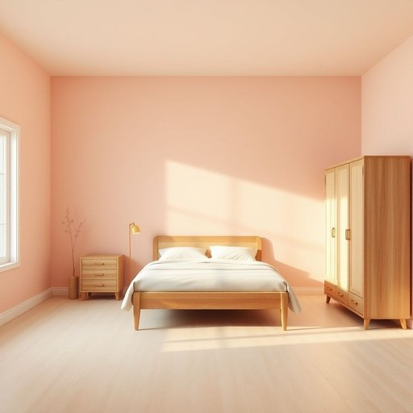

# bedroom

<h1 style="font-size: 2.5em; font-weight: 300; letter-spacing: 2px; margin: 0; color: #2c3e50;">
/ˈbɛˌdrum/
</h1>

---

---

## 例句

After we finish painting the living room and rearranging the kitchen appliances, we should focus on redecorating the bedroom, where the soft pastel walls combined with the vintage wooden furniture will create a cozy and inviting atmosphere that helps us unwind after a long day.

*After(/ˈæftər/) we(/wi/) finish(/ˈfɪnɪʃ/) painting(/ˈpeɪnɪŋ/) the(/ðə/) living(/ˈlɪvɪŋ/) room(/rum/) and(/ənd/) rearranging(/ˌriərˈeɪnʤɪŋ/) the(/ðə/) kitchen(/ˈkɪʧən/) appliances,(/əˈplaɪənsɪz,/) we(/wi/) should(/ʃʊd/) focus(/ˈfoʊkɪs/) on(/ɔn/) redecorating(/riˈdɛkərˌeɪtɪŋ/) the(/ðə/) bedroom,(/ˈbɛˌdrum,/) where(/wɛr/) the(/ðə/) soft(/sɔft/) pastel(/pæˈstɛl/) walls(/wɔlz/) combined(/kəmˈbaɪnd/) with(/wɪθ/) the(/ðə/) vintage(/ˈvɪntɪʤ/) wooden(/ˈwʊdən/) furniture(/ˈfərnɪʧər/) will(/wɪl/) create(/kriˈeɪt/) a(/ə/) cozy(/ˈkoʊzi/) and(/ənd/) inviting(/ˌɪnˈvaɪtɪŋ/) atmosphere(/ˈætməsˌfɪr/) that(/ðət/) helps(/hɛlps/) us(/ˈjuˈɛs/) unwind(/ənˈwaɪnd/) after(/ˈæftər/) a(/ə/) long(/lɔŋ/) day.(/deɪ./)*

**翻译：** 完成客厅的粉刷和厨房电器的重新摆放后，我们应着手重新布置卧室，那里的柔和粉彩墙面与复古木质家具相结合，将营造出一个温馨宜人的氛围，帮助我们在忙碌一天后放松身心。

---

## 解释

英语单词“bedroom”作为名词，指的是居住房屋中专门用于睡觉和休息的房间，通常布置有床、衣柜、床头柜等家具，适用于描述家庭、住宿、酒店等生活环境中的具体空间。在具体使用场合和语境中，常用于谈论居住条件、房屋布局或酒店房型，如“The bedroom is spacious”（卧室很宽敞），或“Book a bedroom with two beds”（预订一间有两张床的卧室）。英语学习者应注意，“bedroom”是可数名词，复数形式为“bedrooms”，且常和表示数量（one, two, three）、位置（master bedroom 主卧）、功能（guest bedroom 客卧）等词语搭配使用。另外，它一般作单数或复数形式使用时，其前可加冠词或数词，但一般不单独指代床本身；“bed”才是指床这个家具。词语来源上，“bedroom”由两个词组成：bed（床）和room（房间），其形成体现了英语合成词的构词特点，早在14世纪就出现，用以明确指代用于睡眠的房间。中文中，“bedroom”准确译为“卧室”，指家居生活中用于睡眠的房间，强调的是该功能区域而非具体家具。在中文语境中，“卧室”没有特殊褒贬含义，属于中性词汇，文化上与西方住宅中卧室的功能和布局相似，常见用于家庭住宅、旅馆或租赁信息等生活场景中。

---

<small style="color: #999; font-size: 0.9em;">2025-07-17 06:22:39</small>

