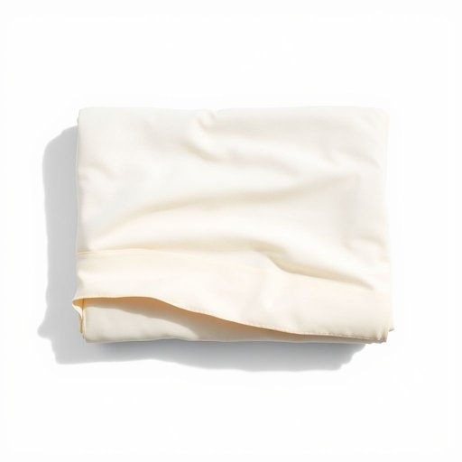

# bedsheet

<h1 style="font-size: 2.5em; font-weight: 300; letter-spacing: 2px; margin: 0; color: #2c3e50;">
/bedsheet*/
</h1>

---

---

## 例句

After washing the bedsheet, which had stubborn stains from last weekend’s barbecue, I carefully ironed it to ensure it looked crisp and fresh before putting it back on the guest bed, where it would hopefully make a good impression on our visitors arriving tomorrow evening.

*After(/ˈæftər/) washing(/ˈwɑʃɪŋ/) the(/ðə/) bedsheet,(/bedsheet*,/) which(/wɪʧ/) had(/hæd/) stubborn(/ˈstəbərn/) stains(/steɪnz/) from(/frəm/) last(/læst/) weekend’s(/weekend’s*/) barbecue,(/ˈbɑrbɪˌkju,/) I(/aɪ/) carefully(/ˈkɛrfəli/) ironed(/aɪərnd/) it(/ɪt/) to(/tɪ/) ensure(/ɪnˈʃʊr/) it(/ɪt/) looked(/lʊkt/) crisp(/krɪsp/) and(/ənd/) fresh(/frɛʃ/) before(/ˌbiˈfɔr/) putting(/ˈpʊtɪŋ/) it(/ɪt/) back(/bæk/) on(/ɔn/) the(/ðə/) guest(/gɛst/) bed,(/bɛd,/) where(/wɛr/) it(/ɪt/) would(/wʊd/) hopefully(/ˈhoʊpfəli/) make(/meɪk/) a(/ə/) good(/gʊd/) impression(/ˌɪmˈprɛʃən/) on(/ɔn/) our(/ɑr/) visitors(/ˈvɪzɪtərz/) arriving(/ərˈaɪvɪŋ/) tomorrow(/təˈmɑˌroʊ/) evening.(/ˈivnɪŋ./)*

**翻译：** 洗完床单后，上面还留着上周末烧烤时留下的顽固污渍，我小心地熨烫了一遍，确保它看起来干净整洁，再铺回客房的床上，希望明晚来访的客人能留下好印象。

---

## 解释

英语单词“bedsheet”作为名词，指的是铺在床垫上或被子下，用于覆盖床铺的大布单，属于家居生活用品范畴，通常在描述卧室、床上用品或睡眠环境时使用。例如，在购买寝具或整理床铺时会用到该词。英语学习者在使用“bedsheet”时应注意它是可数名词，单数形式为“bedsheet”，复数形式为“bedsheets”，常见搭配有“change bedsheets”（换床单）、“make the bed with bedsheets”（用床单整理床铺）等，表达过程中需注意床单的尺寸与床的匹配，如“queen bedsheet”（大号床单）、“king-size bedsheet”（特大号床单），此外，“bedsheet”一般不与“sheet”互换使用时表达完全相同，前者更强调床铺专用的大尺寸单布。词源上，“bedsheet”由“bed”（床）和“sheet”（单子、床单）复合而成，起源于表达专门用于床上的布单，强调其功能性和用途。中文语境中，“bedsheet”准确翻译为“床单”，是指覆盖床褥的织物，与“被单”含义相近但通常更侧重于铺垫作用，不含被子内部的填充物。该词在日常生活中无褒贬色彩，属于中性且实用的词汇，反映了卧室寝具的基本要素和生活习惯，使用时应注意与其他寝具如被套（duvet cover）或毯子（blanket）相区别。

---

<small style="color: #999; font-size: 0.9em;">2025-07-17 06:22:39</small>

