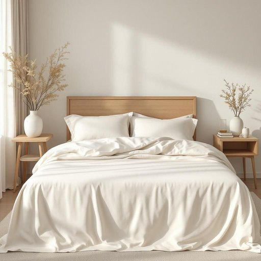

# bedskirt

<h1 style="font-size: 2.5em; font-weight: 300; letter-spacing: 2px; margin: 0; color: #2c3e50;">
/bedskirt*/
</h1>

---

---

## 例句

Before we invite the guests over this weekend, could you kindly replace the faded bedskirt beneath the mattress, which not only conceals the cluttered space underneath but also complements the overall aesthetic of the room with its subtle floral pattern and neatly pleated design?

*Before(/ˌbiˈfɔr/) we(/wi/) invite(/ˌɪnˈvaɪt/) the(/ðə/) guests(/gɛsts/) over(/ˈoʊvər/) this(/ðɪs/) weekend,(/ˈwiˌkɪnd,/) could(/kʊd/) you(/ju/) kindly(/ˈkaɪndli/) replace(/ˌriˈpleɪs/) the(/ðə/) faded(/ˈfeɪdɪd/) bedskirt(/bedskirt*/) beneath(/bɪˈniθ/) the(/ðə/) mattress,(/ˈmætrəs,/) which(/wɪʧ/) not(/nɑt/) only(/ˈoʊnli/) conceals(/kənˈsilz/) the(/ðə/) cluttered(/ˈklətərd/) space(/speɪs/) underneath(/ˌəndərˈniθ/) but(/bət/) also(/ˈɔlsoʊ/) complements(/ˈkɑmpləmənts/) the(/ðə/) overall(/ˈoʊvərˌɔl/) aesthetic(/ɛsˈθɛtɪk/) of(/əv/) the(/ðə/) room(/rum/) with(/wɪθ/) its(/ɪts/) subtle(/ˈsətəl/) floral(/ˈflɔrəl/) pattern(/ˈpætərn/) and(/ənd/) neatly(/ˈnitli/) pleated(/pleated*/) design?(/dɪˈzaɪn?/)*

**翻译：** 在本周末邀请客人到来之前，能否请你更换一下床垫下那条已经褪色的床裙？它不仅能遮盖下面杂乱的空间，还凭借细腻的花卉图案和整齐的褶皱设计，提升整个房间的美感。

---

## 解释

英语单词“bedskirt”作为名词，指的是床裙，即铺在床垫和床架之间、垂挂覆盖床箱、床下空间的装饰性布料，常用于美化卧室环境或隐藏床下储物物品，典型使用场合多见于家庭卧室布置、酒店客房设计等家居生活语境中。学习者使用该词时应注意其为可数名词，常见搭配包括“a bedskirt with pleats”（带褶皱的床裙）、“a decorative bedskirt”（装饰性床裙）等，语法上通常作床家具配件的限定词使用，不能与表示具体床铺的词如“bed”混淆。该词由“bed”（床）与“skirt”（裙子）组合而成，词源体现了其作为床的“裙摆”功能的比喻性质，起源于19世纪床上用品风格化设计的需要。中文语境中“bedskirt”准确翻译为“床裙”，含义明确无褒贬色彩，属于中性且功能性强的家居装饰用品词汇，理解时需避免与床罩（bedspread）或床单（bed sheet）混淆，其文化内涵体现为西方对卧室整洁与美观的审美习惯，对提升整体卧室环境整洁和舒适度有实际作用。

---

<small style="color: #999; font-size: 0.9em;">2025-07-17 06:22:39</small>

