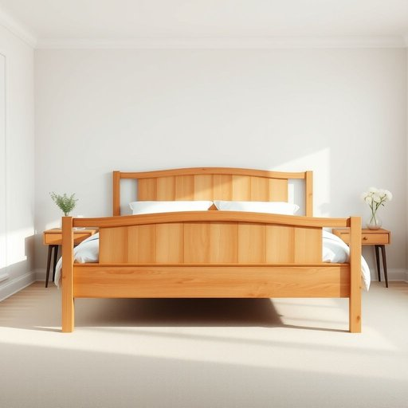

# bedstead

<h1 style="font-size: 2.5em; font-weight: 300; letter-spacing: 2px; margin: 0; color: #2c3e50;">
/bedstead*/
</h1>

---

---

## 例句

After carefully analyzing the bedstead, a cherished family heirloom adorned with detailed iron scrollwork, she concluded it would serve as the ideal centerpiece to enhance the guest bedroom’s warm and sophisticated ambiance.

*After(/ˈæftər/) carefully(/ˈkɛrfəli/) analyzing(/ˈænəˌlaɪzɪŋ/) the(/ðə/) bedstead,(/bedstead*,/) a(/ə/) cherished(/ˈʧɛrɪʃt/) family(/ˈfæməli/) heirloom(/ˈɛˌrlum/) adorned(/əˈdɔrnd/) with(/wɪθ/) detailed(/dɪˈteɪld/) iron(/aɪərn/) scrollwork,(/scrollwork*,/) she(/ʃi/) concluded(/kənˈkludɪd/) it(/ɪt/) would(/wʊd/) serve(/sərv/) as(/ɛz/) the(/ðə/) ideal(/aɪˈdil/) centerpiece(/ˈsɛntərˌpis/) to(/tɪ/) enhance(/ɛnˈhæns/) the(/ðə/) guest(/gɛst/) bedroom’s(/bedroom’s*/) warm(/wɔrm/) and(/ənd/) sophisticated(/səˈfɪstɪˌkeɪtəd/) ambiance.(/ˈæmbiəns./)*

**翻译：** 在仔细分析了这张镶有精美铁艺卷饰的床架——一件珍贵的家传之宝后，她认为它将成为提升客卧温馨且雅致氛围的理想中心装饰。

---

## 解释

“bedstead”作为名词，主要指的是床架，即支撑床垫和床板的结构框架，通常包括床头板、床尾板及侧框架，常用于描述传统或较为坚固的床具。其使用场合多见于描述家具、卧室布置或家居用品的语境中，如在家具店、家装设计、二手家具买卖或历史文献中提及老式床具时较为常见。英语学习者在使用“bedstead”时应注意，它是可数名词，常与形容词连用，如“iron bedstead”（铁质床架）、“wooden bedstead”（木制床架），且通常不与现代床具中的床垫、床单直接搭配，而是强调床的支撑结构。此外，“bedstead”不复数化时指一般床架，复数形式为“bedsteads”。该词源自中古英语，“bed”意为床，“stead”意为场所或位置，合起来即床所在之处或固定床架，体现出其作为床基本支撑结构的本质。中文中，“bedstead”精确对应的词是“床架”或“床架子”，区别于仅指软体部分的“床垫”或整体称为“床”的概念，没有褒贬色彩，属于中性词汇，但因现代英语日常交流中更多使用“bed frame”或简单“bed”代替，“bedstead”稍显书面化和传统，使用时可体现一定的正式或古典家具风格。

---

<small style="color: #999; font-size: 0.9em;">2025-07-17 06:22:39</small>

