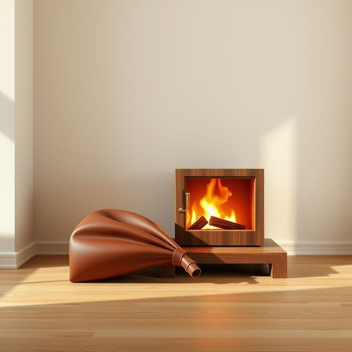

# bellows

<h1 style="font-size: 2.5em; font-weight: 300; letter-spacing: 2px; margin: 0; color: #2c3e50;">
/ˈbɛloʊz/
</h1>

---

---

## 例句

After struggling to light the old wood-burning stove because the fire kept dying out, she finally remembered where her grandfather had stored the bellows—in a dusty cupboard by the fireplace—so she fetched it, and with a few steady pumps, the device sent a strong gust of air through the embers, quickly reviving the flames and filling the room with a warm, comforting glow.

*After(/ˈæftər/) struggling(/ˈstrəgəlɪŋ/) to(/tɪ/) light(/laɪt/) the(/ðə/) old(/oʊld/) wood-burning(/wood-burning*/) stove(/stoʊv/) because(/bɪˈkəz/) the(/ðə/) fire(/faɪər/) kept(/kɛpt/) dying(/daɪɪŋ/) out,(/aʊt,/) she(/ʃi/) finally(/ˈfaɪnəli/) remembered(/rɪˈmɛmbərd/) where(/wɛr/) her(/hər/) grandfather(/ˈgrænˌfɑðər/) had(/hæd/) stored(/stɔrd/) the(/ðə/) bellows—in(/bellows—in*/) a(/ə/) dusty(/ˈdəsti/) cupboard(/ˈkəbərd/) by(/baɪ/) the(/ðə/) fireplace—so(/fireplace—so*/) she(/ʃi/) fetched(/fɛʧt/) it,(/ɪt,/) and(/ənd/) with(/wɪθ/) a(/ə/) few(/fju/) steady(/ˈstɛdi/) pumps,(/pəmps,/) the(/ðə/) device(/dɪˈvaɪs/) sent(/sɛnt/) a(/ə/) strong(/strɔŋ/) gust(/gəst/) of(/əv/) air(/ɛr/) through(/θru/) the(/ðə/) embers,(/ˈɛmbərz,/) quickly(/kˈwɪkli/) reviving(/rɪˈvaɪvɪŋ/) the(/ðə/) flames(/fleɪmz/) and(/ənd/) filling(/ˈfɪlɪŋ/) the(/ðə/) room(/rum/) with(/wɪθ/) a(/ə/) warm,(/wɔrm,/) comforting(/ˈkəmfərtɪŋ/) glow.(/gloʊ./)*

**翻译：** 她费力地点燃那台旧的木柴炉火，因为火焰总是熄灭，终于想起了祖父把风箱放在壁炉旁一个布满灰尘的橱柜里。于是她取出了风箱，经过几次稳健的抽动，风箱送出一阵强劲的气流穿过余烬，迅速复燃了火焰，温暖而宜人的光辉顿时洒满了整个房间。

---

## 解释

英语单词bellows作为名词，在家居生活用品的语境中通常指的是一种风箱，用于通过机械方法将空气吹向燃烧的火炉或壁炉，以增强火势。这种工具多见于传统取暖或烹饪场合，尤其是在燃木炉或炭火炉旁使用。学习者在使用该词时应注意，bellows虽然形态上似乎是复数，但它既可以用作单数也用作复数，具体含义由语境决定；例如，a bellows表示一只风箱，而bellows也可以指多个风箱。此外，常见搭配有operate the bellows（操作风箱）、leather bellows（皮制风箱）等，表达时可以结合动词如pump（抽动）等来形象描述动作。该词源自中古英语bellows，其词根可追溯至古英语belg意为袋子，反映了风箱利用袋状结构吸入并吹出空气的构造特点。在中文语境中，bellows准确翻译为“风箱”，理解时应区别于同音或形似词，强调其作为一种机械装置的功能性。此词在家用环境中较为专业，通常带有复古或传统工艺色彩，使用时无褒贬含义，更多体现实用与工匠精神。

---

<small style="color: #999; font-size: 0.9em;">2025-07-17 06:22:39</small>

