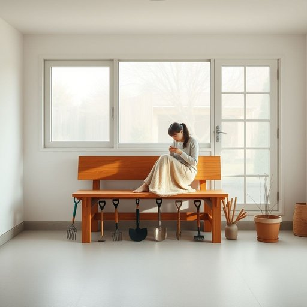

# bench

<h1 style="font-size: 2.5em; font-weight: 300; letter-spacing: 2px; margin: 0; color: #2c3e50;">
/bɛnʧ/
</h1>

---

---

## 例句

After tidying up the cluttered garage, Mum finally decided to install a sturdy wooden bench by the window, not only to create a cosy spot where she could sit and sew, but also to store her gardening tools neatly underneath it.

*After(/ˈæftər/) tidying(/tidying*/) up(/əp/) the(/ðə/) cluttered(/ˈklətərd/) garage,(/gərɑʒ,/) Mum(/məm/) finally(/ˈfaɪnəli/) decided(/ˌdɪˈsaɪdɪd/) to(/tɪ/) install(/ˌɪnˈstɔl/) a(/ə/) sturdy(/ˈstərdi/) wooden(/ˈwʊdən/) bench(/bɛnʧ/) by(/baɪ/) the(/ðə/) window,(/ˈwɪndoʊ,/) not(/nɑt/) only(/ˈoʊnli/) to(/tɪ/) create(/kriˈeɪt/) a(/ə/) cosy(/ˈkoʊzi/) spot(/spɑt/) where(/wɛr/) she(/ʃi/) could(/kʊd/) sit(/sɪt/) and(/ənd/) sew,(/soʊ,/) but(/bət/) also(/ˈɔlsoʊ/) to(/tɪ/) store(/stɔr/) her(/hər/) gardening(/ˈgɑrdənɪŋ/) tools(/tulz/) neatly(/ˈnitli/) underneath(/ˌəndərˈniθ/) it.(/ɪt./)*

**翻译：** 整理好杂乱的车库后，妈妈最终决定在窗边安装一张结实的木质长凳，不仅为自己创造一个舒适的缝纫角落，也能将园艺工具整齐地收纳在长凳下方。

---

## 解释

英语单词“bench”作为名词在家居生活用品场景中，通常指一种长条形的长椅，供人坐卧使用，多见于庭院、走廊、厨房甚至工作间等地方。具体使用场合包括家庭花园的休憩区、公园内的公共座位，以及厨房中的操作台凳等，尤其是在需要多人同时就坐或需要较长座位时。“bench”在语法上通常作为可数名词使用，复数形式为“benches”，且常与修饰词搭配，如“wooden bench”（木制长椅）、“garden bench”（花园长椅）、“park bench”（公园座椅），英语学习者需注意其不可与单数不可数混用。此外，“bench”还可以作为动词，意为“替换下场”，但在家居生活用品语境中无此用法。词源上，“bench”源自古英语“benc”，意指一块长板，最初主要指用来坐或放东西的长条木板，反映了其原始形态和功能，经过演变逐渐指代各种材料和样式的长椅。在中文环境中，“bench”通常准确翻译为“长椅”或“长凳”，但需避免误译为一般的“椅子”，因为bench强调长度和多人使用的特征，而非单人座位。文化上，“bench”作为户外座椅常带有休闲、聚会的色彩，象征着社交空间，且在英美等西方国家的公共场合中较为常见，无明显褒贬色彩，但通过特定上下文可隐含如等待、休息或观望等含义。综上，理解“bench”在家居生活用品中作为名词主要指长条形多人座椅，掌握其语法用法及搭配，准确对应中文“长椅”，能够更精准地运用和理解该词。

---

<small style="color: #999; font-size: 0.9em;">2025-07-17 06:22:39</small>

