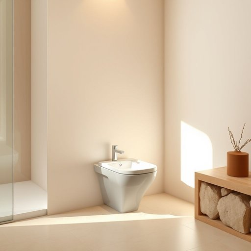

# bidet

<h1 style="font-size: 2.5em; font-weight: 300; letter-spacing: 2px; margin: 0; color: #2c3e50;">
/bidet*/
</h1>

---

---

## 例句

After renovating our bathroom last month, we decided to install a bidet next to the toilet, which, although unfamiliar to some of our guests at first, quickly became an indispensable fixture due to its hygienic benefits and the way it seamlessly complements the overall modern aesthetic we've aimed to achieve in our home.

*After(/ˈæftər/) renovating(/ˈrɛnəˌveɪtɪŋ/) our(/ɑr/) bathroom(/ˈbæθˌrum/) last(/læst/) month,(/mənθ,/) we(/wi/) decided(/ˌdɪˈsaɪdɪd/) to(/tɪ/) install(/ˌɪnˈstɔl/) a(/ə/) bidet(/bidet*/) next(/nɛkst/) to(/tɪ/) the(/ðə/) toilet,(/ˈtɔɪlət,/) which,(/wɪʧ,/) although(/ˌɔlˈðoʊ/) unfamiliar(/ˌənfəˈmɪljər/) to(/tɪ/) some(/səm/) of(/əv/) our(/ɑr/) guests(/gɛsts/) at(/æt/) first,(/fərst,/) quickly(/kˈwɪkli/) became(/bɪˈkeɪm/) an(/ən/) indispensable(/ˌɪndɪˈspɛnsəbəl/) fixture(/ˈfɪksʧər/) due(/du/) to(/tɪ/) its(/ɪts/) hygienic(/hygienic*/) benefits(/ˈbɛnəfɪts/) and(/ənd/) the(/ðə/) way(/weɪ/) it(/ɪt/) seamlessly(/ˈsimləsli/) complements(/ˈkɑmpləmənts/) the(/ðə/) overall(/ˈoʊvərˌɔl/) modern(/ˈmɑdərn/) aesthetic(/ɛsˈθɛtɪk/) we've(/wiv/) aimed(/eɪmd/) to(/tɪ/) achieve(/əˈʧiv/) in(/ɪn/) our(/ɑr/) home.(/hoʊm./)*

**翻译：** 上个月我们翻新了浴室后，决定在马桶旁安装一个智能坐便器。虽然起初有些客人对此感到陌生，但由于其卫生优势及与我们家居整体现代美学的完美契合，它很快便成为了不可或缺的设备。

---

## 解释

“bidet”作为名词在家居生活用品领域指的是一种安装在卫生间内的小型洁身设备，主要用于清洗人体私密部位，尤其是坐便器旁的这一洁具，旨在提供身体清洁和卫生的辅助功能。其具体使用场合通常是浴室或卫生间，常见于欧洲、亚洲部分地区及中东等地的家庭和公共卫生设施中。在英语语境中，学习者需要注意“bidet”通常作为单数名词出现，复数形式为“bidets”，常与动词搭配如“use a bidet”（使用坐浴盆）或“install a bidet”（安装坐浴盆）。表达时需明确其作为洁具的含义，避免与其他浴室设备混淆。词源上，“bidet”源自法语，最早意为骑马的小马或儿童用的小马，因使用方式类似骑坐而命名，后引申为该洁身设备，反映了其设计理念和使用姿势。中文语境中，“bidet”准确翻译为“坐浴盆”或“洗净器”，强调其功能性和用途，属于卫生洁具范畴，无褒贬含义，但其文化接受度因地区差异较大，部分中文用户可能对其存在陌生感或使用习惯差异，因此在实际交流中有必要结合具体语境做进一步解释和介绍。

---

<small style="color: #999; font-size: 0.9em;">2025-07-17 06:22:39</small>

