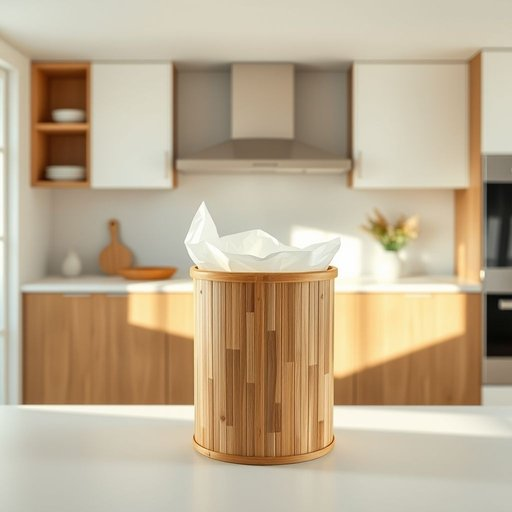

# bin-liner

<h1 style="font-size: 2.5em; font-weight: 300; letter-spacing: 2px; margin: 0; color: #2c3e50;">
/bin-liner*/
</h1>

---

---

## 例句

Before you take out the rubbish this evening, could you please check if the bin-liner in the kitchen bin has any holes or tears, because if it does, the waste might spill and create a mess that’s far harder to clean up than just swapping it for a fresh one?

*Before(/ˌbiˈfɔr/) you(/ju/) take(/teɪk/) out(/aʊt/) the(/ðə/) rubbish(/ˈrəbɪʃ/) this(/ðɪs/) evening,(/ˈivnɪŋ,/) could(/kʊd/) you(/ju/) please(/pliz/) check(/ʧɛk/) if(/ɪf/) the(/ðə/) bin-liner(/bin-liner*/) in(/ɪn/) the(/ðə/) kitchen(/ˈkɪʧən/) bin(/bɪn/) has(/həz/) any(/ˈɛni/) holes(/hoʊlz/) or(/ər/) tears,(/tɪrz,/) because(/bɪˈkəz/) if(/ɪf/) it(/ɪt/) does,(/dɪz,/) the(/ðə/) waste(/weɪst/) might(/maɪt/) spill(/spɪl/) and(/ənd/) create(/kriˈeɪt/) a(/ə/) mess(/mɛs/) that’s(/that’s*/) far(/fɑr/) harder(/ˈhɑrdər/) to(/tɪ/) clean(/klin/) up(/əp/) than(/ðən/) just(/ʤɪst/) swapping(/sˈwɑpɪŋ/) it(/ɪt/) for(/fər/) a(/ə/) fresh(/frɛʃ/) one?(/wən?/)*

**翻译：** 今晚你倒垃圾之前，能否先检查一下厨房垃圾桶里的垃圾袋有没有破洞或撕裂？因为如果有，垃圾可能会洒出来，弄得一团糟，清理起来远比换一个新的麻烦得多。

---

## 解释

bin-liner作为名词，指用于垃圾桶或收纳箱内部的塑料袋或内衬袋，常见于家庭和办公室，用于方便垃圾的收集与清理，防止垃圾污染桶体或容器外部。在使用中，通常出现在讨论清洁、整理环境或购买家居用品的情境，例如“put a bin-liner in the bin”（在垃圾桶里放一个垃圾袋）。该词为复合名词，通常作可数名词使用，常见搭配有“put in a bin-liner”、“replace the bin-liner”、“a roll of bin-liners”等，表达时一般置于名词前或与动词连用。词源上，“bin”意为容器或箱子，来源于中古英语，常指垃圾桶；“liner”来自“line”，意为衬里，bin-liner即“垃圾桶衬袋”，合成词反映其功能和用途。在中文语境中，bin-liner翻译为“垃圾袋”或“垃圾桶内衬袋”，强调其放置于垃圾桶内部以便收集废弃物的作用，无特殊褒贬含义，属于中性且实用的家居生活用品术语，体现现代生活中环境卫生管理的细节需求，文化内涵主要涉及洁净便利和环保意识。

---

<small style="color: #999; font-size: 0.9em;">2025-07-17 06:22:39</small>

