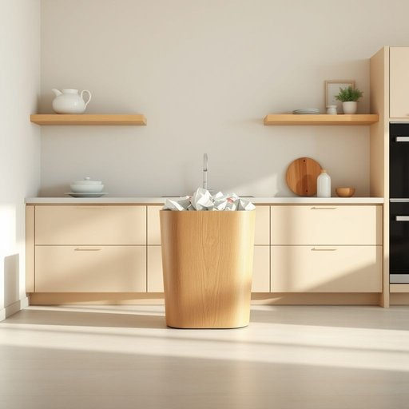

# bin

<h1 style="font-size: 2.5em; font-weight: 300; letter-spacing: 2px; margin: 0; color: #2c3e50;">
/bɪn/
</h1>

---

---

## 例句

The rubbish that accumulated in the kitchen bin, which had been overflowing ever since the dinner party was hosted last weekend, not only needed to be taken out promptly but also required the worktops to be wiped down and the floor swept to restore order.

*The(/ðə/) rubbish(/ˈrəbɪʃ/) that(/ðət/) accumulated(/əˈkjumjəˌleɪtɪd/) in(/ɪn/) the(/ðə/) kitchen(/ˈkɪʧən/) bin,(/bɪn,/) which(/wɪʧ/) had(/hæd/) been(/bɪn/) overflowing(/ˈoʊvərˌfloʊɪŋ/) ever(/ˈɛvər/) since(/sɪns/) the(/ðə/) dinner(/ˈdɪnər/) party(/ˈpɑrti/) was(/wɑz/) hosted(/ˈhoʊstɪd/) last(/læst/) weekend,(/ˈwiˌkɪnd,/) not(/nɑt/) only(/ˈoʊnli/) needed(/ˈnidɪd/) to(/tɪ/) be(/bi/) taken(/ˈteɪkən/) out(/aʊt/) promptly(/ˈprɑmptli/) but(/bət/) also(/ˈɔlsoʊ/) required(/rikˈwaɪərd/) the(/ðə/) worktops(/worktops*/) to(/tɪ/) be(/bi/) wiped(/waɪpt/) down(/daʊn/) and(/ənd/) the(/ðə/) floor(/flɔr/) swept(/swɛpt/) to(/tɪ/) restore(/rɪˈstɔr/) order.(/ˈɔrdər./)*

**翻译：** 自上周末举办晚宴以来一直堆满且溢出的厨房垃圾桶中的垃圾不仅需要及时清理还需擦拭操作台面并扫净地面以恢复整洁。

---

## 解释

英语单词“bin”作为名词在家居生活用品场景中通常指的是一种用于存放或收纳物品的容器，如垃圾桶、储物箱或食品储藏盒等。具体使用场合多见于家庭厨房、卫生间、储藏室及垃圾分类等情境，如“rubbish bin”（垃圾桶）、“storage bin”（储物箱）、“recycling bin”（回收箱）等。英语学习者在使用该词时应注意，“bin”通常作可数名词使用，因此在表达数量时需要加冠词或复数形式，比如“a bin”、“two bins”；此外常见搭配包含“put in the bin”（放入垃圾桶）、“empty the bin”（清空垃圾桶）等表达，体现动作与容器的关系。词源方面，“bin”一词源自中古英语，来自古英语“binn”，意指容器或容纳物品的箱子，起初多指麦仓等储藏容器，逐渐泛指各种收纳用具，带有实用和功能性的意味。在中文语境中，“bin”准确翻译为“桶”、“箱”、“盒”或“箱子”等，视具体用途而定，且通常指较大且用途明确的收纳器具；使用时应避免混淆与其他类似容器的词汇，如“basket”（篮子）、“box”（盒子/箱子，但多泛指）等。该词在日常使用中无明显褒贬色彩，属中性词，带有生活便利和整洁管理的文化内涵，反映现代家庭对环境卫生和物品有序存放的重视。

---

<small style="color: #999; font-size: 0.9em;">2025-07-17 06:22:39</small>

