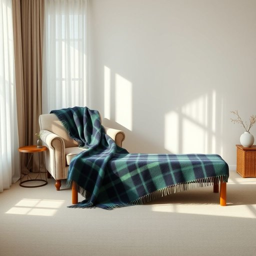

# blanket

<h1 style="font-size: 2.5em; font-weight: 300; letter-spacing: 2px; margin: 0; color: #2c3e50;">
/ˈblæŋkɪt/
</h1>

---

---

## 例句

Could you please bring me the thick woollen blanket from the cupboard in the living room, the one with the blue and green tartan pattern, because the evenings have been getting increasingly chilly, and I want to make sure we're warm and cosy while watching the film tonight?

*Could(/kʊd/) you(/ju/) please(/pliz/) bring(/brɪŋ/) me(/mi/) the(/ðə/) thick(/θɪk/) woollen(/ˈwʊlən/) blanket(/ˈblæŋkɪt/) from(/frəm/) the(/ðə/) cupboard(/ˈkəbərd/) in(/ɪn/) the(/ðə/) living(/ˈlɪvɪŋ/) room,(/rum,/) the(/ðə/) one(/wən/) with(/wɪθ/) the(/ðə/) blue(/blu/) and(/ənd/) green(/grin/) tartan(/ˈtɑrtən/) pattern,(/ˈpætərn,/) because(/bɪˈkəz/) the(/ðə/) evenings(/ˈivnɪŋz/) have(/hæv/) been(/bɪn/) getting(/ˈgɪtɪŋ/) increasingly(/ˌɪnˈkrisɪŋgli/) chilly,(/ˈʧɪli,/) and(/ənd/) I(/aɪ/) want(/wɔnt/) to(/tɪ/) make(/meɪk/) sure(/ʃʊr/) we're(/wɪr/) warm(/wɔrm/) and(/ənd/) cosy(/ˈkoʊzi/) while(/waɪl/) watching(/ˈwɑʧɪŋ/) the(/ðə/) film(/fɪlm/) tonight?(/təˈnaɪt?/)*

**翻译：** 请帮我从客厅的橱柜里拿出那条厚厚的羊毛毯子，就是那条带有蓝绿格子花纹的。最近晚上越来越冷了，我想确保我们今晚看电影时既温暖又舒适。

---

## 解释

英语单词“blanket”作为名词在家居生活用品的语境中，主要指用来保暖的毯子或毛毯，通常是织物制成，覆盖在身上或床上以提供温暖和舒适。具体使用场合多见于卧室、客厅或野营时，例如说“一条羊毛毯”或“给床上盖一条毯子”。英语学习者在使用时需要注意“blanket”作为可数名词，单复数形式分别为“blanket”和“blankets”，且常与形容词搭配，如“厚毯子”、“抓绒毯”。常见表达还有“blanket coverage”，在家居用品领域则着重指物理上的覆盖物。词源上，“blanket”源自中世纪法语“blanchet”，意为“白布”或“宽布”，起初表示一种白色的粗布料，后引申为用于保暖的毯子，这反映了其材质和用途的演变。在中文语境中，最准确的翻译是“毯子”或“毛毯”，强调其柔软且具有保暖功能的特性，不宜混淆为床单或被子。此外，“blanket”在文化上通常无褒贬色彩，属于中性词，但在特定表达如“blanket ban”中具有比喻意义，应注意语境差异。综上所述，“blanket”作为家庭用品时是指一种覆盖身体或床铺，提供温暖的织物物件，学习者应掌握其具体用法、词形变化及不同搭配，避免词义混淆和语境误用。

---

<small style="color: #999; font-size: 0.9em;">2025-07-17 06:22:39</small>

