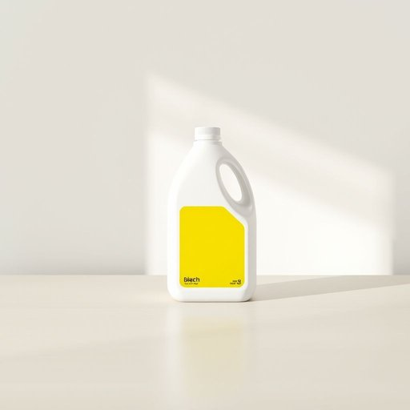

# bleach

<h1 style="font-size: 2.5em; font-weight: 300; letter-spacing: 2px; margin: 0; color: #2c3e50;">
/bliʧ/
</h1>

---

---

## 例句

The bleach that was stored under the sink, which bears a bright yellow label indicating its purpose for whitening clothes and disinfecting surfaces, is essential for ensuring that the kitchen counters are thoroughly cleaned before our guests arrive this evening.

*The(/ðə/) bleach(/bliʧ/) that(/ðət/) was(/wɑz/) stored(/stɔrd/) under(/ˈəndər/) the(/ðə/) sink,(/sɪŋk,/) which(/wɪʧ/) bears(/bɛrz/) a(/ə/) bright(/braɪt/) yellow(/ˈjɛloʊ/) label(/ˈleɪbəl/) indicating(/ˈɪndəˌkeɪtɪŋ/) its(/ɪts/) purpose(/ˈpərpəs/) for(/fər/) whitening(/ˈwaɪtɪnɪŋ/) clothes(/kloʊðz/) and(/ənd/) disinfecting(/disinfecting*/) surfaces,(/ˈsərfəsɪz,/) is(/ɪz/) essential(/ɛˈsɛnʃəl/) for(/fər/) ensuring(/ɪnˈʃʊrɪŋ/) that(/ðət/) the(/ðə/) kitchen(/ˈkɪʧən/) counters(/ˈkaʊntərz/) are(/ər/) thoroughly(/ˈθəroʊli/) cleaned(/klind/) before(/ˌbiˈfɔr/) our(/ɑr/) guests(/gɛsts/) arrive(/əraɪv/) this(/ðɪs/) evening.(/ˈivnɪŋ./)*

**翻译：** 储存在水槽下方的漂白剂，瓶身贴有鲜亮的黄色标签，标明其用于漂白衣物和消毒表面，对于确保今晚客人到来前厨房台面的彻底清洁至关重要。

---

## 解释

英语单词"bleach"在家居生活用品的语境中作为名词，通常指的是一种用于漂白衣物或清洁消毒的化学液体，常见的如含氯漂白剂（chlorine bleach），主要用于去除衣物上的污渍、杀菌消毒或使白色衣物更加洁白。具体使用场合多见于洗衣、家庭卫生清洁等情境，如"Use bleach to whiten your clothes"（用漂白剂使衣服变白）。学习者在使用"bleach"作为名词时应注意它通常不可数，且常与动词"go"，"use"，"add"等连用，常见搭配有"bleach solution"（漂白液）、"chlorine bleach"（氯漂白剂）、"household bleach"（家用漂白剂）。此外，"bleach"作为动词时意为“漂白”，但作为名词时则多指具体的漂白剂产品。词源上，"bleach"来自古英语"blǣcan"，意为“使变白”，与现代英语中的"bleach"内容相符且延续了其使物体变白净的功能。在中文语境中，"bleach"准确翻译为“漂白剂”，理解为一类化学品，具有强烈的去色和杀菌作用，使用时需注意安全，避免对皮肤和织物产生伤害。该词在日常生活中较为中性，但因漂白剂具有较强的化学性质，使用时需谨慎，存在一定的刺激性和腐蚀性，无褒贬色彩，但文化层面上一般与清洁、消毒、洗衣相关联。

---

<small style="color: #999; font-size: 0.9em;">2025-07-17 06:22:39</small>

