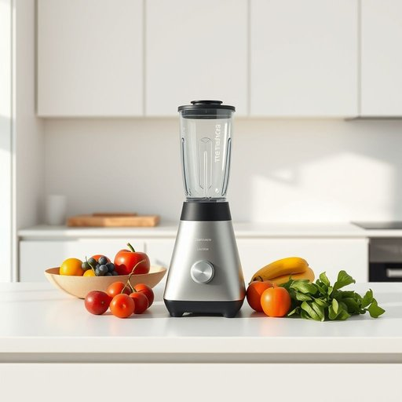

# blender

<h1 style="font-size: 2.5em; font-weight: 300; letter-spacing: 2px; margin: 0; color: #2c3e50;">
/ˈblɛndər/
</h1>

---

---

## 例句

When I realised that the old blender, which had been sitting untouched on the kitchen counter for months, was finally broken beyond repair, I immediately placed an order for a new one online, hoping it would arrive before the weekend so I could prepare my usual smoothies and sauces without any interruption.

*When(/wɪn/) I(/aɪ/) realised(/ˈriəˌlaɪzd/) that(/ðət/) the(/ðə/) old(/oʊld/) blender,(/ˈblɛndər,/) which(/wɪʧ/) had(/hæd/) been(/bɪn/) sitting(/ˈsɪtɪŋ/) untouched(/ənˈtəʧt/) on(/ɔn/) the(/ðə/) kitchen(/ˈkɪʧən/) counter(/ˈkaʊntər/) for(/fər/) months,(/mənθs,/) was(/wɑz/) finally(/ˈfaɪnəli/) broken(/ˈbroʊkən/) beyond(/bɪɔnd/) repair,(/rɪˈpɛr,/) I(/aɪ/) immediately(/ˌɪˈmiˌdiətli/) placed(/pleɪst/) an(/ən/) order(/ˈɔrdər/) for(/fər/) a(/ə/) new(/nu/) one(/wən/) online,(/ˈɔnˌlaɪn,/) hoping(/ˈhoʊpɪŋ/) it(/ɪt/) would(/wʊd/) arrive(/əraɪv/) before(/ˌbiˈfɔr/) the(/ðə/) weekend(/ˈwiˌkɪnd/) so(/soʊ/) I(/aɪ/) could(/kʊd/) prepare(/priˈpɛr/) my(/maɪ/) usual(/ˈjuʒəwəl/) smoothies(/smoothies*/) and(/ənd/) sauces(/ˈsɔsɪz/) without(/wɪˈθaʊt/) any(/ˈɛni/) interruption.(/ˌɪntərˈəpʃən./)*

**翻译：** 当我意识到那台放在厨房台面上几个月未曾使用的旧搅拌机终于坏得无法修复时，我立刻在网上订购了一台新的，希望它能在周末前送达，这样我就能不间断地制作平时的果昔和酱料。

---

## 解释

英语单词“blender”作为家居生活用品中的名词，指的是一种电动搅拌机，用于将食材如水果、蔬菜、坚果等混合、打碎成浆状或均匀液体，常见于厨房环境中制作果汁、奶昔、汤料或酱料等。使用场合多为家庭烹饪或餐饮准备，语境通常涉及食品加工或厨房电器。英语学习者在使用“blender”时应注意其作为名词通常不可数但可数形式存在，如“a blender”表示一台设备，复数为“blenders”；此外，常见搭配包括“use a blender”（使用搅拌机）、“put ingredients in the blender”（把食材放入搅拌机）等表达。该词源于动词“blend”（混合、搅拌）加上名词后缀“-er”，表示执行该动作的工具，起源于20世纪20世纪初现代厨房电器的发展。中文语境中，“blender”准确翻译为“搅拌机”或“果汁机”，强调其功能性，没有贬义或特殊文化色彩，属于中性、实用性的词汇。使用时应区分与“mixer”（搅拌器，一般用于面团等较浓稠物质）等设备的区别，以免混淆。

---

<small style="color: #999; font-size: 0.9em;">2025-07-17 06:22:39</small>

