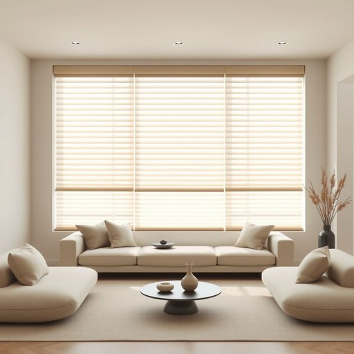

# blind

<h1 style="font-size: 2.5em; font-weight: 300; letter-spacing: 2px; margin: 0; color: #2c3e50;">
/blaɪnd/
</h1>

---

---

## 例句

Could you please tighten the blind in the living room, which has been left slightly open since this morning, because the sunlight is making it difficult to see the television clearly and also causing the furniture to fade over time?

*Could(/kʊd/) you(/ju/) please(/pliz/) tighten(/ˈtaɪtən/) the(/ðə/) blind(/blaɪnd/) in(/ɪn/) the(/ðə/) living(/ˈlɪvɪŋ/) room,(/rum,/) which(/wɪʧ/) has(/həz/) been(/bɪn/) left(/lɛft/) slightly(/sˈlaɪtli/) open(/ˈoʊpən/) since(/sɪns/) this(/ðɪs/) morning,(/ˈmɔrnɪŋ,/) because(/bɪˈkəz/) the(/ðə/) sunlight(/ˈsənˌlaɪt/) is(/ɪz/) making(/ˈmeɪkɪŋ/) it(/ɪt/) difficult(/ˈdɪfəkəlt/) to(/tɪ/) see(/si/) the(/ðə/) television(/ˈtɛləˌvɪʒən/) clearly(/ˈklɪrli/) and(/ənd/) also(/ˈɔlsoʊ/) causing(/ˈkɔzɪŋ/) the(/ðə/) furniture(/ˈfərnɪʧər/) to(/tɪ/) fade(/feɪd/) over(/ˈoʊvər/) time?(/taɪm?/)*

**翻译：** 请您将客厅的百叶窗拉紧一些，因为从今早起它一直微微开启，阳光不仅影响看电视的清晰度，也会随着时间使家具褪色。

---

## 解释

在家居生活用品语境中，英语单词"blind"作为名词主要指窗帘或百叶窗等遮光、遮挡视线的装饰物，通常用于调节室内采光和保护隐私。具体使用场合多见于描述房间窗户的布置，比如“pull down the blind”（拉下百叶窗）或“install blinds on the windows”（在窗户上安装百叶窗）。英语学习者需注意，作为名词时"blind"通常为复数形式"blinds"，表示一组窗帘或百叶窗，且复数形式虽表示整体装置，语法上仍视为复数。常见搭配有“venetian blinds”（百叶窗）、“roller blinds”（卷帘）、“window blinds”（窗帘），此外，"blind"也可用作形容词或动词，但作为名词时重点是在窗户遮光物上。词源上，"blind"来自古英语"blind"（无法看见的），引申为遮挡视线的物品，反映其遮蔽光线和视觉的功能。在中文语境中，"blind"名词常被译为“百叶窗”或“窗帘”，具体取决于其材质和功能，涵义明确且中性，无褒贬色彩，但需避免与形容词“blind”（盲的）混淆。文化上，现代家居生活中blind作为百叶窗或卷帘，是常见且实用的窗饰品，暗示对隐私和舒适环境的注重。总体而言，理解"blind"作为名词在家居中的用法，有助于准确描述室内设计和生活场景。

---

<small style="color: #999; font-size: 0.9em;">2025-07-17 06:22:39</small>

