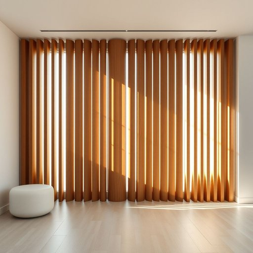

# blinds

<h1 style="font-size: 2.5em; font-weight: 300; letter-spacing: 2px; margin: 0; color: #2c3e50;">
/blaɪndz/
</h1>

---

---

## 例句

The blinds in the office provided necessary privacy while simultaneously enhancing the room’s aesthetic appeal with their sleek wooden design.

*The(/ðə/) blinds(/blaɪndz/) in(/ɪn/) the(/ðə/) office(/ˈɔfəs/) provided(/prəˈvaɪdɪd/) necessary(/ˈnɛsəˌsɛri/) privacy(/ˈpraɪvəsi/) while(/waɪl/) simultaneously(/ˌsaɪməlˈteɪniəsli/) enhancing(/ɛnˈhænsɪŋ/) the(/ðə/) room’s(/room’s*/) aesthetic(/ɛsˈθɛtɪk/) appeal(/əˈpil/) with(/wɪθ/) their(/ðɛr/) sleek(/slik/) wooden(/ˈwʊdən/) design.(/dɪˈzaɪn./)*

**翻译：** 办公室的百叶窗既提供了必要的隐私保护，又以其光滑的木质设计提升了房间的美感。

---

## 解释

英语单词"blinds"作为名词，主要指窗户上的百叶窗或卷帘，用以调节室内光线和保护隐私，常见于家庭、办公场所等室内环境，具体使用场合通常是描述住宅或办公室窗户装饰或遮光设备，如“close the blinds”（拉下百叶窗）或“adjust the blinds”（调节百叶窗）。英语学习者需要注意，"blinds"通常以复数形式出现，因为单个百叶窗条板不指整体装置，整体设备用复数，且在语法上做名词时常与动词搭配，如“blinds are open/closed”，而非单数形式“blind”来指代该装置。此外，常用搭配包括“window blinds”（窗帘）、“vertical blinds”（垂直百叶窗）、“horizontal blinds”（水平百叶窗）等，在表达技巧上，理解"blinds"不仅是遮挡物，也具备调光、隐私保护的功能，有助于丰富描述。词源方面，"blind"源自古英语“blind”，意为“失明”，引申为遮挡视线的装置，复数形式"blinds"后来专指窗户上的遮光设备，这种词义转变反映了其功能性的比喻。中文语境中，"blinds"应准确翻译为“百叶窗”或“卷帘”，根据具体类型而定，避免误译为“盲人”或“眼罩”，以免引起混淆，这个词本身无明显褒贬含义，属于中性词汇，但在家居布局和设计讨论中常关联舒适度和隐私保护的文化内涵。

---

<small style="color: #999; font-size: 0.9em;">2025-07-17 06:22:39</small>

