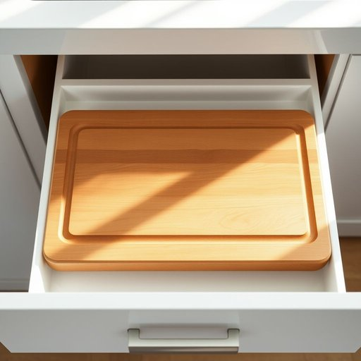

# board

<h1 style="font-size: 2.5em; font-weight: 300; letter-spacing: 2px; margin: 0; color: #2c3e50;">
/bɔrd/
</h1>

---

---

## 例句

Before we start preparing the dinner, could you please bring the chopping board from the kitchen drawer next to the sink, the one with deep grooves designed to prevent juices from spilling onto the countertop, so we can safely slice the vegetables without making a mess?

*Before(/ˌbiˈfɔr/) we(/wi/) start(/stɑrt/) preparing(/pərˈpɛrɪŋ/) the(/ðə/) dinner,(/ˈdɪnər,/) could(/kʊd/) you(/ju/) please(/pliz/) bring(/brɪŋ/) the(/ðə/) chopping(/ˈʧɑpɪŋ/) board(/bɔrd/) from(/frəm/) the(/ðə/) kitchen(/ˈkɪʧən/) drawer(/drɔr/) next(/nɛkst/) to(/tɪ/) the(/ðə/) sink,(/sɪŋk,/) the(/ðə/) one(/wən/) with(/wɪθ/) deep(/dip/) grooves(/gruvz/) designed(/dɪˈzaɪnd/) to(/tɪ/) prevent(/prɪˈvɛnt/) juices(/ˈʤusɪz/) from(/frəm/) spilling(/ˈspɪlɪŋ/) onto(/ˈɔntu/) the(/ðə/) countertop,(/ˈkaʊntərˌtɑp,/) so(/soʊ/) we(/wi/) can(/kən/) safely(/ˈseɪfli/) slice(/slaɪs/) the(/ðə/) vegetables(/ˈvɛʤtəbəlz/) without(/wɪˈθaʊt/) making(/ˈmeɪkɪŋ/) a(/ə/) mess?(/mɛs?/)*

**翻译：** 在我们开始准备晚餐之前，能否请你从水槽旁边的厨房抽屉里拿出那个切菜板？那个带有深槽设计的，可以防止果汁溢出台面，这样我们就能安心切菜，不会弄得一团糟。

---

## 解释

英语单词“board”在家居生活用品场景中作为名词，通常指“板”、“木板”或“菜板”等具有平面形态的硬质材料，常用于切菜的“cutting board”（砧板）或家具构件中的“shelf board”（架板）。具体使用场合多见于厨房、家具组装或装修环境中，如“kitchen board”（厨房砧板），表示日常生活中的实物用品。英语学习者在使用该词时需注意，作为可数名词时通常指具体的木板或板材，复数形式为“boards”，且常与修饰词搭配使用，如“wooden board”（木制板）、“chalk board”（黑板），此外，“board”可引申为“委员会”或“船板”等含义，需根据上下文区分。语法上，“board”作为名词时一般作主语、宾语或宾语补足语，且在固定搭配中常与介词短语连用，如“on board”（在船上、飞机上）等，但家居用品语境中较少。该词源自古英语“bord”，原指木板或桌面，反映其作为坚硬平面材料的本质属性。中文环境中，“board”准确翻译为“板”或具体凭上下文可译为“砧板”、“木板”等，语义明确、无褒贬色彩或特殊文化含义，属于中性词汇，使用广泛且易于理解。

---

<small style="color: #999; font-size: 0.9em;">2025-07-17 06:22:39</small>

