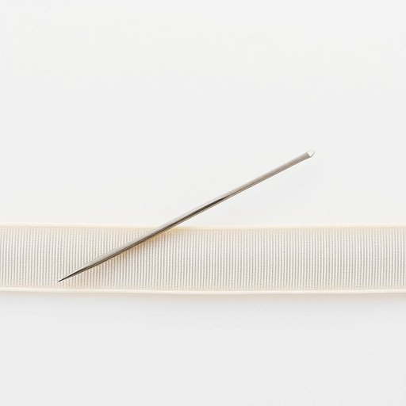

# bodkin

<h1 style="font-size: 2.5em; font-weight: 300; letter-spacing: 2px; margin: 0; color: #2c3e50;">
/ˈbɑdkɪn/
</h1>

---

---

## 例句

When I was trying to mend the frayed ribbon on the curtains, I realised that without a bodkin—a slender, pointed tool designed specifically to thread cords or ribbons through narrow casings—it would be nearly impossible to complete the job neatly, especially given how tightly woven the fabric is.

*When(/wɪn/) I(/aɪ/) was(/wɑz/) trying(/traɪɪŋ/) to(/tɪ/) mend(/mɛnd/) the(/ðə/) frayed(/freɪd/) ribbon(/ˈrɪbən/) on(/ɔn/) the(/ðə/) curtains,(/ˈkərtənz,/) I(/aɪ/) realised(/ˈriəˌlaɪzd/) that(/ðət/) without(/wɪˈθaʊt/) a(/ə/) bodkin—a(/bodkin—a*/) slender,(/sˈlɛndər,/) pointed(/ˈpɔɪntɪd/) tool(/tul/) designed(/dɪˈzaɪnd/) specifically(/spəˈsɪfɪkli/) to(/tɪ/) thread(/θrɛd/) cords(/kɔrdz/) or(/ər/) ribbons(/ˈrɪbənz/) through(/θru/) narrow(/ˈnɛroʊ/) casings—it(/casings—it*/) would(/wʊd/) be(/bi/) nearly(/ˈnɪrli/) impossible(/ˌɪmˈpɑsəbəl/) to(/tɪ/) complete(/kəmˈplit/) the(/ðə/) job(/ʤɑb/) neatly,(/ˈnitli,/) especially(/əˈspɛʃəli/) given(/ˈgɪvɪn/) how(/haʊ/) tightly(/ˈtaɪtli/) woven(/ˈwoʊvən/) the(/ðə/) fabric(/ˈfæbrɪk/) is.(/ɪz./)*

**翻译：** 当我试图修补窗帘上磨损的缎带时，我意识到如果没有穿针器——一种细长尖锐、专为将绳索或缎带穿过狭窄通道而设计的工具——几乎不可能将这项工作整齐地完成，尤其是考虑到布料织得如此紧密。

---

## 解释

单词“bodkin”作为名词，在家居生活用品的英语场景中通常指一种细长而尖锐的小工具，常用于缝纫或纺织过程中，类似于穿线器或尖头的穿线针，帮助将线材穿过织物或绳索。具体使用场合多见于手工缝制、织布或修补工作中，尤其是在需要将绳索、松紧带或细丝穿过布料管道时会用到。英语学习者在使用“bodkin”时应注意其作为可数名词的用法，常搭配的表达有“a bodkin for threading”（用于穿线的bodkin）、“use a bodkin to pull the elastic”（用bodkin将松紧带拉过），且通常不用于一般家庭日用品外的广泛语境。此外，该词源自中古英语，最初指锋利的短刀，后来含义转向细长的穿线工具，源自古法语“bochkin”或“bodekin”，这种历史背景反映了其从武器工具向实用针具的转变。中文中，“bodkin”准确理解为“穿线针”或“小锥子”，在缝纫领域是专业用语，日常生活中不常用且无褒贬含义，也无特殊文化色彩，属于中性且较为小众的手工工具词汇。

---

<small style="color: #999; font-size: 0.9em;">2025-07-17 06:22:39</small>

