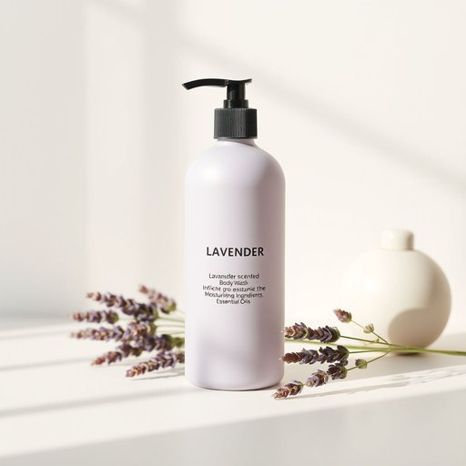

# body-wash

<h1 style="font-size: 2.5em; font-weight: 300; letter-spacing: 2px; margin: 0; color: #2c3e50;">
/body-wash*/
</h1>

---

---

## 例句

Could you please grab the lavender-scented body-wash from the bathroom cabinet, the one that’s enriched with moisturisers and essential oils, because after such a long day it’s exactly what I need to feel refreshed and relaxed before dinner?

*Could(/kʊd/) you(/ju/) please(/pliz/) grab(/græb/) the(/ðə/) lavender-scented(/lavender-scented*/) body-wash(/body-wash*/) from(/frəm/) the(/ðə/) bathroom(/ˈbæθˌrum/) cabinet,(/ˈkæbənət,/) the(/ðə/) one(/wən/) that’s(/that’s*/) enriched(/ɛnˈrɪʧt/) with(/wɪθ/) moisturisers(/moisturisers*/) and(/ənd/) essential(/ɛˈsɛnʃəl/) oils,(/ɔɪlz,/) because(/bɪˈkəz/) after(/ˈæftər/) such(/səʧ/) a(/ə/) long(/lɔŋ/) day(/deɪ/) it’s(/it’s*/) exactly(/ɪgˈzæktli/) what(/wət/) I(/aɪ/) need(/nid/) to(/tɪ/) feel(/fil/) refreshed(/riˈfrɛʃt/) and(/ənd/) relaxed(/rɪˈlækst/) before(/ˌbiˈfɔr/) dinner?(/ˈdɪnər?/)*

**翻译：** 你能帮我从浴室的橱柜里拿一下那瓶薰衣草香氛沐浴露吗？就是那种添加了保湿成分和精油的，因为经历了这么漫长的一天，晚饭前正需要它带给我清新和放松的感觉。

---

## 解释

“body-wash”作为名词在家居生活用品的语境中指的是一种用于清洁人体皮肤的液体洗涤用品，类似于沐浴乳或沐浴露，具体使用场合通常是在洗澡或淋浴时，用于替代传统的肥皂，使皮肤得到清洁和保湿，常见于浴室、超市的洗浴用品区或美容护肤产品的描述中，英语学习者在使用“body-wash”时需要注意它通常用作不可数名词，也可以根据需要用复数形式“body washes”指不同品牌或类别的产品，此外，它多用作复合名词，前半部分“body”修饰后半部分“wash”，整体作名词使用，且常见的搭配包括“body wash bottle（沐浴露瓶）”、“moisturizing body wash（保湿型沐浴露）”等表达，词源方面，“body”指人体，“wash”源自动词“洗”，合成词“body wash”即表示“用于清洗身体的液体”，最早出现于20世纪后半叶，随着现代护理用品的发展而普及，中文语境中，“body-wash”准确的翻译为“沐浴露”或“沐浴乳”，强调其液体形态和用于身体清洁的特性，不同于“香皂”或“澡粉”等固体清洁品，在语言色彩与文化内涵方面，“body wash”属于中性词汇，无褒贬含义，反映现代人对个人卫生和护肤细致入微的需求，体现了一种注重方便、温和护理的生活态度。

---

<small style="color: #999; font-size: 0.9em;">2025-07-17 06:22:39</small>

