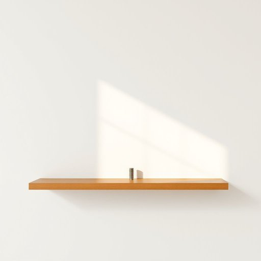

# bolt

<h1 style="font-size: 2.5em; font-weight: 300; letter-spacing: 2px; margin: 0; color: #2c3e50;">
/boʊlt/
</h1>

---

---

## 例句

I struggled to complete the installation of the new bookshelf yesterday because the bolt, a crucial piece of hardware I needed to secure the heavy frame to the wall, was missing, forcing me to rush to the hardware store early this morning in hopes of finding the exact size in stock.

*I(/aɪ/) struggled(/ˈstrəgəld/) to(/tɪ/) complete(/kəmˈplit/) the(/ðə/) installation(/ˌɪnstəˈleɪʃən/) of(/əv/) the(/ðə/) new(/nu/) bookshelf(/ˈbʊkˌʃɛlf/) yesterday(/ˈjɛstərˌdeɪ/) because(/bɪˈkəz/) the(/ðə/) bolt,(/boʊlt,/) a(/ə/) crucial(/ˈkruʃəl/) piece(/pis/) of(/əv/) hardware(/ˈhɑrdˌwɛr/) I(/aɪ/) needed(/ˈnidɪd/) to(/tɪ/) secure(/sɪˈkjʊr/) the(/ðə/) heavy(/ˈhɛvi/) frame(/freɪm/) to(/tɪ/) the(/ðə/) wall,(/wɔl,/) was(/wɑz/) missing,(/ˈmɪsɪŋ,/) forcing(/ˈfɔrsɪŋ/) me(/mi/) to(/tɪ/) rush(/rəʃ/) to(/tɪ/) the(/ðə/) hardware(/ˈhɑrdˌwɛr/) store(/stɔr/) early(/ˈərli/) this(/ðɪs/) morning(/ˈmɔrnɪŋ/) in(/ɪn/) hopes(/hoʊps/) of(/əv/) finding(/ˈfaɪndɪŋ/) the(/ðə/) exact(/ɪgˈzækt/) size(/saɪz/) in(/ɪn/) stock.(/stɑk./)*

**翻译：** 昨天我在完成新书架安装时遇到了困难，因为固定沉重支架所需的一枚关键螺栓不翼而飞，这迫使我今早一大早赶往五金店，希望能找到尺寸完全相符的备件。

---

## 解释

英语单词“bolt”在家居生活用品的语境中作为名词，通常指的是一种用于门窗或家具开关、固定的闩、插销或螺栓。具体使用场合包括门的安全装置，如门闩（door bolt），以及家具或机械的紧固件（如螺栓），用于连接或固定零部件。英语学习者在使用“bolt”时需注意其可数名词性质，常用复数形式“bolts”，并且结合具体语境区分其含义，如“a door bolt”强调门用的插销，而“a bolt and nut”则指紧固用的螺栓和螺母；常见搭配有“slide bolt”（滑动闩）、“locking bolt”（锁定插销）等。语法上，作为名词可以直接作主语、宾语，也常出现在介词短语中，如“bolt on the door”。词源方面，“bolt”源自古英语“bolt”，意指投掷用的箭矢或标枪，后来引申为紧固物，体现其“快速插入”或“固定”之意，具有明显的动作与稳固功能的历史背景。在中文语境中，“bolt”准确翻译为“门闩”“插销”或“螺栓”，根据具体用途区别使用，反映了其物理功能上的固定和保护作用。该词本身无褒贬含义，使用时需结合上下文明确指代对象，以避免混淆其作为动词“bolt”（猛冲、逃跑）的含义。整体来看，“bolt”作为家居生活用品名词，强调的是安全固定与机械连接的实用功能。

---

<small style="color: #999; font-size: 0.9em;">2025-07-17 06:22:39</small>

