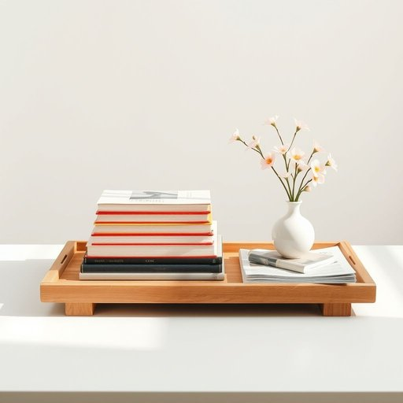

# book

<h1 style="font-size: 2.5em; font-weight: 300; letter-spacing: 2px; margin: 0; color: #2c3e50;">
/bʊk/
</h1>

---

---

## 例句

Could you please pass me the book that’s lying on the coffee table next to the vase of fresh flowers and the stack of magazines, as I’d like to read a few chapters before we start preparing dinner?

*Could(/kʊd/) you(/ju/) please(/pliz/) pass(/pæs/) me(/mi/) the(/ðə/) book(/bʊk/) that’s(/that’s*/) lying(/laɪɪŋ/) on(/ɔn/) the(/ðə/) coffee(/ˈkɔfi/) table(/ˈteɪbəl/) next(/nɛkst/) to(/tɪ/) the(/ðə/) vase(/vɑz/) of(/əv/) fresh(/frɛʃ/) flowers(/flaʊərz/) and(/ənd/) the(/ðə/) stack(/stæk/) of(/əv/) magazines,(/ˈmægəˌzinz,/) as(/ɛz/) I’d(/i’d*/) like(/laɪk/) to(/tɪ/) read(/rɛd/) a(/ə/) few(/fju/) chapters(/ˈʧæptərz/) before(/ˌbiˈfɔr/) we(/wi/) start(/stɑrt/) preparing(/pərˈpɛrɪŋ/) dinner?(/ˈdɪnər?/)*

**翻译：** 请把放在咖啡桌上、靠近鲜花花瓶和一摞杂志旁的那本书递给我，我想在我们开始准备晚饭之前读几章。

---

## 解释

英语单词“book”作为名词，在家居生活用品的语境中，主要指家庭中用于阅读、学习或装饰的书籍，通常是纸质的印刷物，比如小说、教科书、杂志等，常见于书架、桌面或床头柜上。英语学习者在使用“book”时需要注意其单数和复数形式，单数为“book”，复数为“books”，此外，常见搭配有“a book on (某一主题)”、“a hardcover book”（精装书）、“a paperback book”（平装书）、“to put a book on the shelf”（把书放上书架）等，此外“book”作为名词时不可直接用作可数或不可数混淆，如表示多本书时应使用复数。词源上，“book”源自古英语“bōc”，意指用字母记录的文本，相关于日耳曼语族中记录文字的词，与“beech”（山毛榉树）有关，历史上书籍曾用山毛榉树皮书写。中文语境中，“book”准确翻译为“书”或“书籍”，且在家居生活用品的分类中，指的是阅读材料，不包含电子书等非实体物品。“book”在日常用语中通常为中性词，既无褒义也无贬义，但在某些文学或文化语境中可能象征知识积累、文化传承等积极内涵。在家居生活中，书不仅是实用的阅读材料，也常作为装饰和文化象征存在。

---

<small style="color: #999; font-size: 0.9em;">2025-07-17 06:22:39</small>

