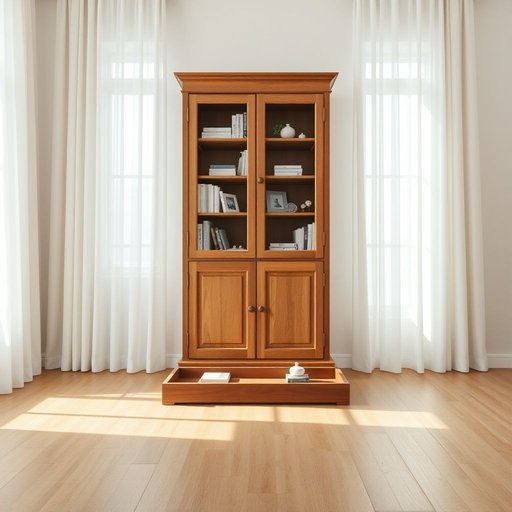

# bookcase

<h1 style="font-size: 2.5em; font-weight: 300; letter-spacing: 2px; margin: 0; color: #2c3e50;">
/ˈbʊkˌkeɪs/
</h1>

---

---

## 例句

In the living room, where the sunlight filters softly through the curtains and casts a warm glow on the worn wooden floor, she carefully arranged her collection of novels, photo albums, and assorted trinkets in the tall, antique bookcase that had been passed down through generations, ensuring that each item was not only accessible but also aesthetically pleasing amidst the eclectic mix of modern and vintage décor.

*In(/ɪn/) the(/ðə/) living(/ˈlɪvɪŋ/) room,(/rum,/) where(/wɛr/) the(/ðə/) sunlight(/ˈsənˌlaɪt/) filters(/ˈfɪltərz/) softly(/ˈsɔftli/) through(/θru/) the(/ðə/) curtains(/ˈkərtənz/) and(/ənd/) casts(/kæsts/) a(/ə/) warm(/wɔrm/) glow(/gloʊ/) on(/ɔn/) the(/ðə/) worn(/wɔrn/) wooden(/ˈwʊdən/) floor,(/flɔr,/) she(/ʃi/) carefully(/ˈkɛrfəli/) arranged(/əreɪnʤd/) her(/hər/) collection(/kəˈlɛkʃən/) of(/əv/) novels,(/ˈnɑvəlz,/) photo(/ˈfoʊˌtoʊ/) albums,(/ˈælbəmz,/) and(/ənd/) assorted(/əˈsɔrtɪd/) trinkets(/ˈtrɪŋkəts/) in(/ɪn/) the(/ðə/) tall,(/tɔl,/) antique(/ænˈtik/) bookcase(/ˈbʊkˌkeɪs/) that(/ðət/) had(/hæd/) been(/bɪn/) passed(/pæst/) down(/daʊn/) through(/θru/) generations,(/ˌʤɛnərˈeɪʃənz,/) ensuring(/ɪnˈʃʊrɪŋ/) that(/ðət/) each(/iʧ/) item(/ˈaɪtəm/) was(/wɑz/) not(/nɑt/) only(/ˈoʊnli/) accessible(/ækˈsɛsəbəl/) but(/bət/) also(/ˈɔlsoʊ/) aesthetically(/ɛsˈθɛtɪkli/) pleasing(/ˈplizɪŋ/) amidst(/əˈmɪdst/) the(/ðə/) eclectic(/ɪˈklɛktɪk/) mix(/mɪks/) of(/əv/) modern(/ˈmɑdərn/) and(/ənd/) vintage(/ˈvɪntɪʤ/) décor.(/décor*./)*

**翻译：** 在客厅里，阳光透过窗帘洒下柔和的光线，温暖地映照在那略显斑驳的木质地板上。她小心翼翼地将自己的小说、相册和各式小摆件整齐地摆放在那座历经数代传承的高大古董书架中，既确保每件物品触手可及，又让它们在现代与复古混搭的装修风格中显得赏心悦目。

---

## 解释

英语单词“bookcase”作为名词，在家居生活用品的语境中指的是用于存放和展示书籍的家具，一般为带有多个隔层的柜子或架子，多见于书房、客厅或办公室等场所，用以整理和保护书籍，同时也能起到装饰空间的作用。学习者使用该词时应注意其为可数名词，复数形式为“bookcases”，常见搭配有“wooden bookcase”（木制书柜）、“large bookcase”（大书柜）、“built-in bookcase”（嵌入式书柜）等。另外，bookcase通常用于具体实物，不用于抽象意义，表达时可用作主语、宾语或定语，如“The bookcase is full of novels.”词源上，bookcase由“book”（书）和“case”（盒子、柜子）组合而成，反映其功能为储存书本的容器，起源于中世纪英语中的家具命名习惯，强调物品的实用性和容器属性。在中文语境中，bookcase通常被准确翻译为“书柜”或“书架”，两者含义相近但书柜更强调柜体结构，有门或封闭设计，而书架则多为开放式架子，需结合具体家具形态选择用词。该词无特殊褒贬色彩，为中性词，既强调实用功能，也常带有文化氛围和生活品味的象征意义，体现对阅读和知识的重视。

---

<small style="color: #999; font-size: 0.9em;">2025-07-17 06:22:39</small>

