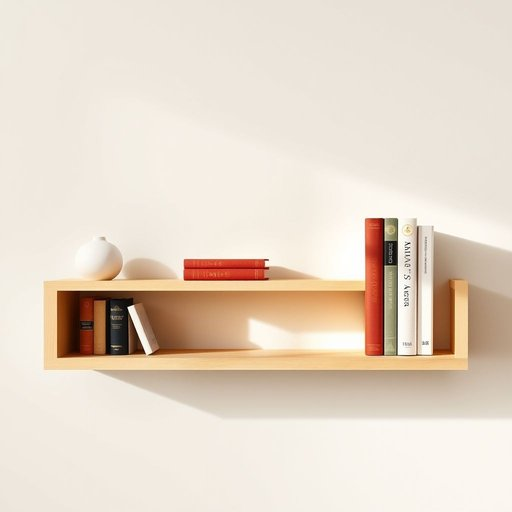

# bookend

<h1 style="font-size: 2.5em; font-weight: 300; letter-spacing: 2px; margin: 0; color: #2c3e50;">
/ˈbʊˌkɛnd/
</h1>

---

---

## 例句

Although the shelf was already crowded with a mixture of old novels and family photo albums, she insisted on placing the ornate brass bookend she had inherited from her grandmother at the far right, not only to prevent the books from toppling over but also to add a touch of vintage charm to the living room’s otherwise modern decor.

*Although(/ˌɔlˈðoʊ/) the(/ðə/) shelf(/ʃɛlf/) was(/wɑz/) already(/ɔˈrɛdi/) crowded(/ˈkraʊdɪd/) with(/wɪθ/) a(/ə/) mixture(/ˈmɪksʧər/) of(/əv/) old(/oʊld/) novels(/ˈnɑvəlz/) and(/ənd/) family(/ˈfæməli/) photo(/ˈfoʊˌtoʊ/) albums,(/ˈælbəmz,/) she(/ʃi/) insisted(/ˌɪnˈsɪstɪd/) on(/ɔn/) placing(/ˈpleɪsɪŋ/) the(/ðə/) ornate(/ɔrˈneɪt/) brass(/bræs/) bookend(/ˈbʊˌkɛnd/) she(/ʃi/) had(/hæd/) inherited(/ˌɪnˈhɛrətɪd/) from(/frəm/) her(/hər/) grandmother(/ˈgrændˌməðər/) at(/æt/) the(/ðə/) far(/fɑr/) right,(/raɪt,/) not(/nɑt/) only(/ˈoʊnli/) to(/tɪ/) prevent(/prɪˈvɛnt/) the(/ðə/) books(/bʊks/) from(/frəm/) toppling(/ˈtɑpəlɪŋ/) over(/ˈoʊvər/) but(/bət/) also(/ˈɔlsoʊ/) to(/tɪ/) add(/æd/) a(/ə/) touch(/təʧ/) of(/əv/) vintage(/ˈvɪntɪʤ/) charm(/ʧɑrm/) to(/tɪ/) the(/ðə/) living(/ˈlɪvɪŋ/) room’s(/room’s*/) otherwise(/ˈəðərˌwaɪz/) modern(/ˈmɑdərn/) decor.(/ˈdeɪkɔr./)*

**翻译：** 尽管书架上已经摆满了旧小说和家庭相册的混合物，她仍坚持将那只从祖母那里继承的华丽铜质书挡放在最右侧，这不仅为了防止书籍倒落，更为了在客厅原本现代的装饰中增添一抹复古的韵味。

---

## 解释

英语单词“bookend”在家居生活用品语境中作为名词，指的是用于书架上支撑书籍，防止其倒塌或滑落的装饰性或实用性支架。具体使用场合通常为书房、客厅或办公室的书架和桌面，用于稳定摆放的书本，使其排列整齐。在使用时，英语学习者需要注意“bookend”作为可数名词，常见的复数形式为“bookends”，且常与动词“use”、“place”、“buy”等搭配，如“use a pair of bookends to keep the books upright”。此外，“bookend”也可作为动词使用，意为“以书挡住”，但在家居用品语境中多指名词。词源方面，“bookend”由“book”（书）和“end”（末端）组合而成，起初指放置于书的两端的支架，帮助保持书籍立直，体现了功能的直观描述。在中文语境中，bookend通常被准确翻译为“书挡”或“书立”，强调其作为支撑书本的工具的功能，没有褒贬色彩，属于中性且实用的家居物品词汇，文化含义主要体现为整理和保护书籍的实用作用。

---

<small style="color: #999; font-size: 0.9em;">2025-07-17 06:22:39</small>

