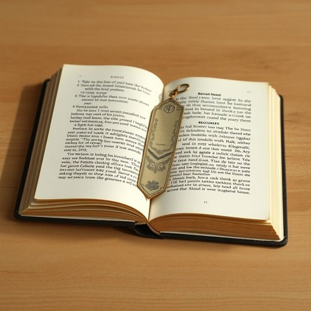

# bookmark

<h1 style="font-size: 2.5em; font-weight: 300; letter-spacing: 2px; margin: 0; color: #2c3e50;">
/ˈbʊkmɑrk/
</h1>

---

---

## 例句

After spending the afternoon rearranging the bookshelf in the living room, I finally found the delicate bookmark, which my grandmother had gifted me years ago and which I had tucked carefully between the pages of my favourite novel, lying forgotten under a pile of magazines on the coffee table.

*After(/ˈæftər/) spending(/ˈspɛndɪŋ/) the(/ðə/) afternoon(/ˌæftərˈnun/) rearranging(/ˌriərˈeɪnʤɪŋ/) the(/ðə/) bookshelf(/ˈbʊkˌʃɛlf/) in(/ɪn/) the(/ðə/) living(/ˈlɪvɪŋ/) room,(/rum,/) I(/aɪ/) finally(/ˈfaɪnəli/) found(/faʊnd/) the(/ðə/) delicate(/ˈdɛləkət/) bookmark,(/ˈbʊkmɑrk,/) which(/wɪʧ/) my(/maɪ/) grandmother(/ˈgrændˌməðər/) had(/hæd/) gifted(/ˈgɪftɪd/) me(/mi/) years(/jɪrz/) ago(/əˈgoʊ/) and(/ənd/) which(/wɪʧ/) I(/aɪ/) had(/hæd/) tucked(/təkt/) carefully(/ˈkɛrfəli/) between(/bɪtˈwin/) the(/ðə/) pages(/ˈpeɪʤɪz/) of(/əv/) my(/maɪ/) favourite(/ˈfeɪvərɪt/) novel,(/ˈnɑvəl,/) lying(/laɪɪŋ/) forgotten(/fərˈgɑtən/) under(/ˈəndər/) a(/ə/) pile(/paɪl/) of(/əv/) magazines(/ˈmægəˌzinz/) on(/ɔn/) the(/ðə/) coffee(/ˈkɔfi/) table.(/ˈteɪbəl./)*

**翻译：** 在客厅花了一个下午整理书架后，我终于找到了那枚精致的书签——这是多年前奶奶送给我的，我小心翼翼地夹在最喜欢的小说书页之间，却不经意地遗忘在茶几上一堆杂志底下。

---

## 解释

单词"bookmark"作为名词在家居生活用品的语境中，通常指用来夹在书页之间以便记住阅读位置的小物件，如纸质书签。具体使用场合多为看书、学习或阅读时需要暂时中断并想要快速找到断点的场景，常见于家庭、图书馆或学校中。英语学习者应注意，bookmark作为可数名词，其复数形式为bookmarks，常与动词搭配如“use a bookmark”（使用书签），“put a bookmark in a book”（在书中放置书签）等。此外，bookmark也可引申为网络用语中“收藏夹”的含义，但在家居用品语境下应强调其作为物理对象的身份。词源上，bookmark由“book”和“mark”组合而成，意指“书中的标记”，起源于早期印刷书籍普及后人们为了方便记忆阅读位置而设计的小工具。中文语境中，bookmark一般被准确翻译为“书签”，这一翻译直接反映其物理功能和用途，通常无褒贬色彩，也无特殊文化内涵，只是实用性的阅读辅助工具。

---

<small style="color: #999; font-size: 0.9em;">2025-07-17 06:22:39</small>

