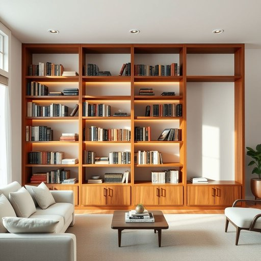

# bookshelf

<h1 style="font-size: 2.5em; font-weight: 300; letter-spacing: 2px; margin: 0; color: #2c3e50;">
/ˈbʊkˌʃɛlf/
</h1>

---

---

## 例句

Could you please help me move the old bookshelf from the living room to the study, where it will not only free up some much-needed space but also provide a perfect spot to neatly organise the collection of novels and historical biographies that have been gathering dust on the dining table?

*Could(/kʊd/) you(/ju/) please(/pliz/) help(/hɛlp/) me(/mi/) move(/muv/) the(/ðə/) old(/oʊld/) bookshelf(/ˈbʊkˌʃɛlf/) from(/frəm/) the(/ðə/) living(/ˈlɪvɪŋ/) room(/rum/) to(/tɪ/) the(/ðə/) study,(/ˈstədi,/) where(/wɛr/) it(/ɪt/) will(/wɪl/) not(/nɑt/) only(/ˈoʊnli/) free(/fri/) up(/əp/) some(/səm/) much-needed(/much-needed*/) space(/speɪs/) but(/bət/) also(/ˈɔlsoʊ/) provide(/prəˈvaɪd/) a(/ə/) perfect(/ˈpərˌfɪkt/) spot(/spɑt/) to(/tɪ/) neatly(/ˈnitli/) organise(/organise*/) the(/ðə/) collection(/kəˈlɛkʃən/) of(/əv/) novels(/ˈnɑvəlz/) and(/ənd/) historical(/hɪˈstɔrɪkəl/) biographies(/baɪˈɑgrəfiz/) that(/ðət/) have(/hæv/) been(/bɪn/) gathering(/ˈgæðərɪŋ/) dust(/dəst/) on(/ɔn/) the(/ðə/) dining(/ˈdaɪnɪŋ/) table?(/ˈteɪbəl?/)*

**翻译：** 您能帮我把客厅的旧书架搬到书房吗？这样不仅能腾出急需的空间，还能为那些堆积在餐桌上积灰的小说和历史传记提供一个整齐收纳的理想位置。

---

## 解释

英语单词“bookshelf”作为名词，主要指家居生活中用于放置书籍的家具，通常为开放式的架子，能够整齐地陈列和存储书本，常见于书房、客厅或办公室等场合。在日常语境中，人们会用“bookshelf”描述家里的书架，如“The bookshelf in the living room is full of novels”（客厅的书架上摆满了小说）。英语学习者需注意“bookshelf”是可数名词，复数形式为“bookshelves”，且常与表示存储或整理的动词搭配，如“put books on the bookshelf”、“organize the bookshelf”，也常见固定搭配“bookcase”和“bookshelf”两词意思相近，但“bookcase”通常指有门或更封闭的书架，使用上有所区分。该词源自“book”（书本）和“shelf”（架子）两个单词的复合，体现了该物品的功能属性，即专门为书本设计的置物架。中文语境中，“bookshelf”准确翻译为“书架”，不仅指物理上的架子，也象征知识的积累和文化的传承，通常无褒贬色彩，属于中性词汇，广泛应用于家庭和公共场所，是描述家居环境的重要词汇。

---

<small style="color: #999; font-size: 0.9em;">2025-07-17 06:22:39</small>

