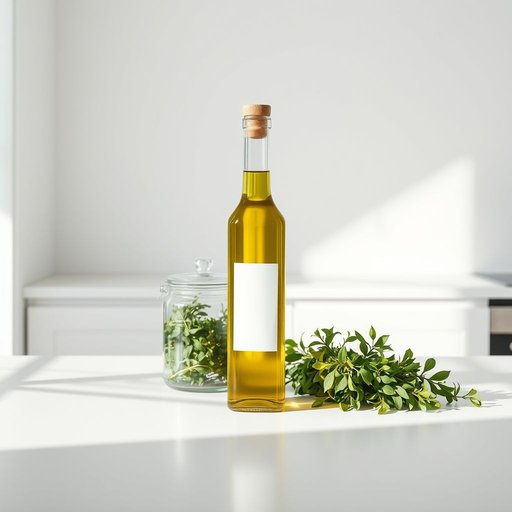

# bottle

<h1 style="font-size: 2.5em; font-weight: 300; letter-spacing: 2px; margin: 0; color: #2c3e50;">
/ˈbɑtəl/
</h1>

---

---

## 例句

Could you please pass me the bottle of olive oil that's sitting next to the jar of herbs on the kitchen counter, as I need it to finish marinating the chicken before we start cooking?

*Could(/kʊd/) you(/ju/) please(/pliz/) pass(/pæs/) me(/mi/) the(/ðə/) bottle(/ˈbɑtəl/) of(/əv/) olive(/ˈɑlɪv/) oil(/ɔɪl/) that's(/ðæts/) sitting(/ˈsɪtɪŋ/) next(/nɛkst/) to(/tɪ/) the(/ðə/) jar(/ʤɑr/) of(/əv/) herbs(/ərbz/) on(/ɔn/) the(/ðə/) kitchen(/ˈkɪʧən/) counter,(/ˈkaʊntər,/) as(/ɛz/) I(/aɪ/) need(/nid/) it(/ɪt/) to(/tɪ/) finish(/ˈfɪnɪʃ/) marinating(/ˈmɛrəˌneɪtɪŋ/) the(/ðə/) chicken(/ˈʧɪkən/) before(/ˌbiˈfɔr/) we(/wi/) start(/stɑrt/) cooking?(/ˈkʊkɪŋ?/)*

**翻译：** 请帮我递一下放在厨房台面上那罐香草旁边的橄榄油瓶，我需要它来完成腌制鸡肉，然后我们才能开始烹饪。

---

## 解释

英语单词“bottle”在家居生活用品的语境中作为名词，指的是一种用来盛装液体的容器，通常由玻璃、塑料或金属制成，形状多为瓶状，带有瓶颈和瓶口，便于注入和倒出液体。具体使用场合包括厨房中盛放水、饮料、酱油、油类等液体，浴室内的洗发水、沐浴露瓶，或者用于储存调味品和药品的容器。在英语学习中，使用“bottle”时需注意其复数形式为“bottles”，且作为可数名词，常与数量词连用，如“a bottle of water”。常见搭配有“water bottle”（水瓶）、“milk bottle”（牛奶瓶）、“plastic bottle”（塑料瓶）、“bottle cap”（瓶盖）、“bottle opener”（开瓶器）等。另外，“bottle up”作为短语动词有“抑制情感”的意思，但这里不在讨论范围内。“bottle”一词源自中古法语“bouteille”，进一步追溯至拉丁语“butticula”，意指小桶或酒桶，显示其与液体储存的历史渊源。在中文语境中，准确翻译为“瓶子”，一般指日常生活中常见的液体容器，没有褒贬含义，属于中性词汇，广泛用于各种家居场合。需要注意的是，“bottle”侧重指容量较小、便于手持的瓶状容器，而非大桶、大罐等更大容器，理解时应区别于如“jar”（罐子）、“can”（罐头罐）等其他容器词。总体而言，“bottle”作为家居用品名词使用时，含义明确，音形义对应紧密，适合日常生活中描述各种液体容器。

---

<small style="color: #999; font-size: 0.9em;">2025-07-17 06:22:39</small>

