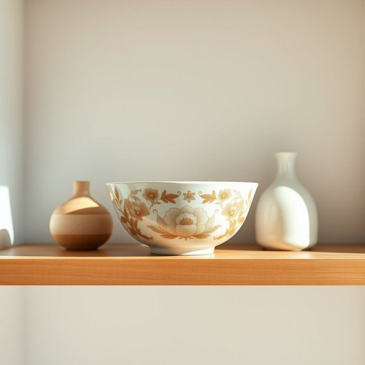

# bowl

<h1 style="font-size: 2.5em; font-weight: 300; letter-spacing: 2px; margin: 0; color: #2c3e50;">
/boʊl/
</h1>

---

---

## 例句

After carefully washing the delicate ceramic bowl, whose intricate floral pattern shimmered under the kitchen light, she placed the bowl on the wooden shelf beside old crockery, ensuring the bowl would be ideal for serving a variety of soups or salads during festive family dinners.

*After(/ˈæftər/) carefully(/ˈkɛrfəli/) washing(/ˈwɑʃɪŋ/) the(/ðə/) delicate(/ˈdɛləkət/) ceramic(/sərˈæmɪk/) bowl,(/boʊl,/) whose(/huz/) intricate(/ˈɪntrəkət/) floral(/ˈflɔrəl/) pattern(/ˈpætərn/) shimmered(/ˈʃɪmərd/) under(/ˈəndər/) the(/ðə/) kitchen(/ˈkɪʧən/) light,(/laɪt,/) she(/ʃi/) placed(/pleɪst/) the(/ðə/) bowl(/boʊl/) on(/ɔn/) the(/ðə/) wooden(/ˈwʊdən/) shelf(/ʃɛlf/) beside(/ˌbiˈsaɪd/) old(/oʊld/) crockery,(/ˈkrɑkəri,/) ensuring(/ɪnˈʃʊrɪŋ/) the(/ðə/) bowl(/boʊl/) would(/wʊd/) be(/bi/) ideal(/aɪˈdil/) for(/fər/) serving(/ˈsərvɪŋ/) a(/ə/) variety(/vərˈaɪəti/) of(/əv/) soups(/sups/) or(/ər/) salads(/ˈsælədz/) during(/ˈdʊrɪŋ/) festive(/ˈfɛstɪv/) family(/ˈfæməli/) dinners.(/ˈdɪnərz./)*

**翻译：** 她小心翼翼地洗净了那只精致的瓷碗，碗上复杂的花卉图案在厨房灯光下闪烁着光芒，然后将碗轻轻地放在木制架子上，旁边是一些旧瓷器，确保这只碗在节日家宴中盛装各类汤品或沙拉时再合适不过。

---

## 解释

英语单词“bowl”作为名词在家居生活用品场景中，通常指一种开口较大、较深、呈碗状的容器，常用来盛放食物如汤、沙拉、谷物或水果等，典型使用场合包括厨房、餐厅及家庭用餐环境。学习者在使用“bowl”时需注意，它多为可数名词，复数形式为“bowls”，且常见搭配有“a bowl of”（一碗……），例如a bowl of soup（一碗汤）、a bowl of rice（一碗米饭），此外，“mixing bowl”（搅拌碗）、“cereal bowl”（麦片碗）等也为常见表达。语法上，bowl不能与不可数名词直接搭配，需用“a bowl of”结构表达量。词源上，“bowl”源自古英语“bolla”，与古高地德语“polla”同源，最初指圆形的器皿，其形态和用途在历史上基本保持稳定。中文中，“bowl”准确翻译为“碗”，强调其容器性质和使用功能，具备实用和中性色彩，无特殊褒贬或文化负面含义，但在文化层面上，碗作为日常生活必备器皿，代表着食物的盛放和共享，有时也象征家庭温馨和亲情。

---

<small style="color: #999; font-size: 0.9em;">2025-07-17 06:22:39</small>

