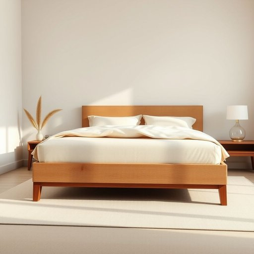

# boxspring

<h1 style="font-size: 2.5em; font-weight: 300; letter-spacing: 2px; margin: 0; color: #2c3e50;">
/boxspring*/
</h1>

---

---

## 例句

When we redecorated the guest bedroom, I insisted on getting a high-quality boxspring, not only because it provides superior support and extends the mattress's lifespan, but also because its sturdy wooden frame, combined with the elegant fabric covering, complements the room's overall aesthetic far better than a basic divan base would.

*When(/wɪn/) we(/wi/) redecorated(/riˈdɛkərˌeɪtɪd/) the(/ðə/) guest(/gɛst/) bedroom,(/ˈbɛˌdrum,/) I(/aɪ/) insisted(/ˌɪnˈsɪstɪd/) on(/ɔn/) getting(/ˈgɪtɪŋ/) a(/ə/) high-quality(/ˌhaɪkˈwɑləti/) boxspring,(/boxspring*,/) not(/nɑt/) only(/ˈoʊnli/) because(/bɪˈkəz/) it(/ɪt/) provides(/prəˈvaɪdz/) superior(/suˈpɪriər/) support(/səˈpɔrt/) and(/ənd/) extends(/ɪkˈstɛndz/) the(/ðə/) mattress's(/ˈmætrəsɪz/) lifespan,(/ˈlaɪfˌspæn,/) but(/bət/) also(/ˈɔlsoʊ/) because(/bɪˈkəz/) its(/ɪts/) sturdy(/ˈstərdi/) wooden(/ˈwʊdən/) frame,(/freɪm,/) combined(/kəmˈbaɪnd/) with(/wɪθ/) the(/ðə/) elegant(/ˈɛləgənt/) fabric(/ˈfæbrɪk/) covering,(/ˈkəvərɪŋ,/) complements(/ˈkɑmpləmənts/) the(/ðə/) room's(/rumz/) overall(/ˈoʊvərˌɔl/) aesthetic(/ɛsˈθɛtɪk/) far(/fɑr/) better(/ˈbɛtər/) than(/ðən/) a(/ə/) basic(/ˈbeɪsɪk/) divan(/dɪˈvæn/) base(/beɪs/) would.(/wʊd./)*

**翻译：** 在重新装修客卧时，我坚持选购高品质的弹簧床垫。这样不仅能提供更优越的支撑，延长床垫的使用寿命，其坚固的木质框架配以优雅的织物包覆，也比普通的沙发床底座更好地衬托了整个房间的整体美感。

---

## 解释

boxspring作为名词主要指家居中床垫下用来支撑床垫的弹簧箱架，通常由木框架包裹弹簧组成，放置在床架上以提升床垫的弹性和耐用性，常见于西方国家的卧室环境，尤其在讨论床具配置、卧室陈设或者购买床垫配件时出现。英语学习者在使用boxspring时应注意它是一个可数名词，复数形式为boxsprings，通常与bed、mattress搭配出现，如a boxspring for the mattress或replace the boxspring，其中boxspring多与修饰床垫支撑和舒适度的形容词连用。此词由box（箱子）和spring（弹簧）复合而成，源自19世纪末到20世纪初西方床具设计的演变，以强调其结构为一个包含弹簧的框箱装置。中文中准确翻译为弹簧床箱或床垫弹簧底座，强调其在床具中的支撑作用，能够配合床垫提供弹性支撑，区别于单纯的床架或床垫。该词通常中性，无褒贬含义，在家居生活用品语境中属专业床具术语，了解后有助于更准确地进行卧室布置和床具选购，但应注意在汉语日常对话中不常直接使用，一般以床箱或弹簧床箱描述更符合习惯。

---

<small style="color: #999; font-size: 0.9em;">2025-07-17 06:22:39</small>

