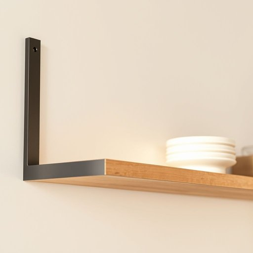

# bracket

<h1 style="font-size: 2.5em; font-weight: 300; letter-spacing: 2px; margin: 0; color: #2c3e50;">
/ˈbrækɪt/
</h1>

---

---

## 例句

Could you carefully examine the bracket, a crucial component that has been slightly loose for some time, to determine whether it requires tightening or replacement in order to prevent the entire kitchen shelf from collapsing unexpectedly?

*Could(/kʊd/) you(/ju/) carefully(/ˈkɛrfəli/) examine(/ɪgˈzæmɪn/) the(/ðə/) bracket,(/ˈbrækɪt,/) a(/ə/) crucial(/ˈkruʃəl/) component(/kəmˈpoʊnənt/) that(/ðət/) has(/həz/) been(/bɪn/) slightly(/sˈlaɪtli/) loose(/lus/) for(/fər/) some(/səm/) time,(/taɪm,/) to(/tɪ/) determine(/dɪˈtərmən/) whether(/ˈwɛðər/) it(/ɪt/) requires(/rikˈwaɪərz/) tightening(/ˈtaɪtənɪŋ/) or(/ər/) replacement(/rɪˈpleɪsmənt/) in(/ɪn/) order(/ˈɔrdər/) to(/tɪ/) prevent(/prɪˈvɛnt/) the(/ðə/) entire(/ɪnˈtaɪər/) kitchen(/ˈkɪʧən/) shelf(/ʃɛlf/) from(/frəm/) collapsing(/kəˈlæpsɪŋ/) unexpectedly?(/ˌənɪkˈspɛktɪdli?/)*

**翻译：** 请您仔细检查那个安装架，它是一个关键部件，已经有一段时间略显松动，请判断是否需要紧固或更换，以防整个厨房架子意外倒塌。

---

## 解释

英语单词“bracket”在家居生活用品场景中作为名词，通常指用于支撑或固定某物的金属或塑料托架，例如墙壁上的托架用来支撑书架、台面或其他家具。这类bracket通常呈“L”形或其他角度设计，能够稳固地连接物体与墙面或其他表面，使得物品悬挂或固定更为牢固，常见于家具安装、装修和收纳场合。英语学习者在使用“bracket”时应注意其单数和复数形式，单数为“bracket”，复数为“brackets”，且常与动词“install”、“fix”、“support”等搭配，表达安装、固定或支撑的动作，例如“install brackets on the wall”“use brackets to hold the shelf”。此外，“bracket”在非家居语境中还有括号的含义，这点需区分以避免混淆。词源上，“bracket”源自中古法语“braguette”（意为裤裆部分的扣子，后来引申为支架），进一步追溯到意第绪语或德语，含有支撑物的概念。该词在中文中的准确翻译应为“支架”或“托架”，根据具体功能和形状可有细微调整，但“支架”是最通用、准确的译法。该词本身中性无褒贬色彩，在日常家居用品和装修用语中使用广泛且规范，没有特殊文化内涵或语言色彩。

---

<small style="color: #999; font-size: 0.9em;">2025-07-17 06:22:39</small>

