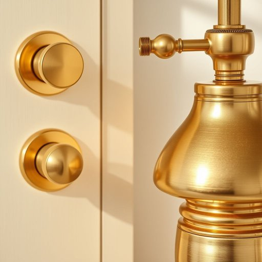

# brass

<h1 style="font-size: 2.5em; font-weight: 300; letter-spacing: 2px; margin: 0; color: #2c3e50;">
/bræs/
</h1>

---

---

## 例句

Could you please polish the brass fixtures in the living room, including the door handles and the lamp bases, before our guests arrive this evening, since they’ve become quite tarnished and dull after months without proper cleaning?

*Could(/kʊd/) you(/ju/) please(/pliz/) polish(/ˈpɑlɪʃ/) the(/ðə/) brass(/bræs/) fixtures(/ˈfɪksʧərz/) in(/ɪn/) the(/ðə/) living(/ˈlɪvɪŋ/) room,(/rum,/) including(/ˌɪnˈkludɪŋ/) the(/ðə/) door(/dɔr/) handles(/ˈhændəlz/) and(/ənd/) the(/ðə/) lamp(/læmp/) bases,(/ˈbeɪsɪz,/) before(/ˌbiˈfɔr/) our(/ɑr/) guests(/gɛsts/) arrive(/əraɪv/) this(/ðɪs/) evening,(/ˈivnɪŋ,/) since(/sɪns/) they’ve(/they’ve*/) become(/bɪˈkəm/) quite(/kwaɪt/) tarnished(/ˈtɑrnɪʃt/) and(/ənd/) dull(/dəl/) after(/ˈæftər/) months(/mənθs/) without(/wɪˈθaʊt/) proper(/ˈprɑpər/) cleaning?(/ˈklinɪŋ?/)*

**翻译：** 今晚客人来之前，能请您把客厅里的黄铜装饰品擦亮一下吗？包括门把手和灯座，因为它们几个月没好好清洁，已经变得暗淡发黑。

---

## 解释

英语单词“brass”作为名词在家居生活用品语境中主要指“一种黄铜合金”，即由铜和锌组成的金属，因其颜色呈金黄色且具有良好的导电性和耐腐蚀性，常用于制造门把手、水龙头、灯具、装饰件以及乐器等家居用品。使用该词时需注意其不可数名词的属性，通常不加复数形式，但在某些表达中也可指“黄铜制品”时使用复数“brasses”。常见搭配有“brass fittings”（黄铜配件）、“brass handles”（黄铜把手）、“brass fixtures”（黄铜装置）等，学习者应注意区分“brass”作为材料名词与作为乐器组（如“the brass”指铜管乐器群）的不同用法。词源方面，“brass”起源于古英语“bræs”，可能来源于日耳曼语系，反映了欧洲早期对黄铜材料的认知和应用。中文中准确翻译为“黄铜”，其含义直接指代该金属材料本身或由其制成的用品，通常无褒贬意味，但在文化语境中，“brass”偶尔作为俗语有“厚脸皮”、“胆大”的隐喻用法，与家居用品无关，应区别对待。总之，在家居生活中提及“brass”时，重点是指实用且常见的黄铜制品，反映了材质特性及其工艺品的实用价值。

---

<small style="color: #999; font-size: 0.9em;">2025-07-17 06:22:39</small>

