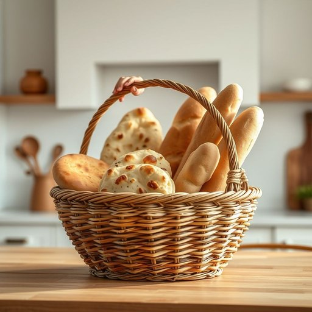

# bread-basket

<h1 style="font-size: 2.5em; font-weight: 300; letter-spacing: 2px; margin: 0; color: #2c3e50;">
/bread-basket*/
</h1>

---

---

## 例句

As we gathered around the kitchen island chatting about our weekend plans, Maria reached for the large, colorful bread-basket filled with an assortment of rolls and baguettes, explaining how she loved to bring it along to picnics because its sturdy handle and charming design made it both practical and visually appealing, instantly becoming the centerpiece of any meal.

*As(/ɛz/) we(/wi/) gathered(/ˈgæðərd/) around(/əraʊnd/) the(/ðə/) kitchen(/ˈkɪʧən/) island(/ˈaɪlənd/) chatting(/ˈʧætɪŋ/) about(/əˈbaʊt/) our(/ɑr/) weekend(/ˈwiˌkɪnd/) plans,(/plænz,/) Maria(/mərˈiə/) reached(/riʧt/) for(/fər/) the(/ðə/) large,(/lɑrʤ,/) colorful(/ˈkələrfəl/) bread-basket(/bread-basket*/) filled(/fɪld/) with(/wɪθ/) an(/ən/) assortment(/əˈsɔrtmənt/) of(/əv/) rolls(/roʊlz/) and(/ənd/) baguettes,(/baguettes*,/) explaining(/ɪkˈspleɪnɪŋ/) how(/haʊ/) she(/ʃi/) loved(/ləvd/) to(/tɪ/) bring(/brɪŋ/) it(/ɪt/) along(/əˈlɔŋ/) to(/tɪ/) picnics(/ˈpɪkˌnɪks/) because(/bɪˈkəz/) its(/ɪts/) sturdy(/ˈstərdi/) handle(/ˈhændəl/) and(/ənd/) charming(/ˈʧɑrmɪŋ/) design(/dɪˈzaɪn/) made(/meɪd/) it(/ɪt/) both(/boʊθ/) practical(/ˈpræktɪkəl/) and(/ənd/) visually(/ˈvɪʒwəli/) appealing,(/əˈpilɪŋ,/) instantly(/ˈɪnstəntli/) becoming(/bɪˈkəmɪŋ/) the(/ðə/) centerpiece(/ˈsɛntərˌpis/) of(/əv/) any(/ˈɛni/) meal.(/mil./)*

**翻译：** 当我们围坐在厨房岛台，聊着周末的计划时，玛丽亚伸手拿起那个装满各种面包卷和法棍的大而色彩艳丽的面包篮，边说她喜欢带它去野餐，因为结实的提手和别致的设计不仅实用，还赏心悦目，瞬间成为任何一餐的焦点。

---

## 解释

bread-basket作为名词在家居生活用品的语境中，指的是用来盛放面包的篮子，常见于餐桌、厨房或餐厅中，用于摆放刚出炉或切片的面包，既方便取用又具有装饰作用。使用时通常搭配面包相关的词汇，如"bread basket on the table"（桌上的面包篮）或"pass the bread basket"（传递面包篮）等，语法上一般作为可数名词使用，注意其复数形式为bread baskets。英语学习者应注意区分其字面含义与比喻用法（如“breadbasket”可指产粮区，但家居用品语境下专指盛放面包的篮子）。该词由bread（面包）与basket（篮子）组成，直观指代装面包的篮子，起源于传统家庭用具，将面包整齐摆放在小篮中以便于运送和取用，反映了饮食文化中的实用性和美观性。中文中准确翻译为“面包篮”或“面包筐”，强调其功能性和日常生活使用属性，无褒贬色彩，属于中性词语，文化内涵较少，主要体现西方用餐习惯中的一种器皿，帮助学习者理解物品的具体用途及其在家庭餐饮场景中的常见性。

---

<small style="color: #999; font-size: 0.9em;">2025-07-17 06:22:39</small>

