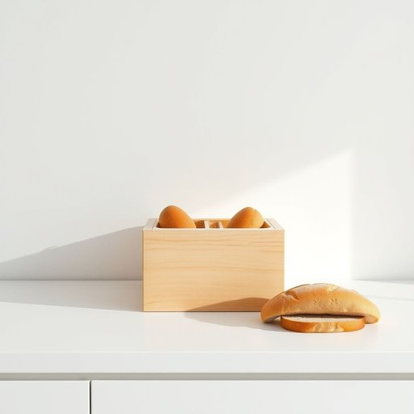

# bread-box

<h1 style="font-size: 2.5em; font-weight: 300; letter-spacing: 2px; margin: 0; color: #2c3e50;">
/bread-box*/
</h1>

---

---

## 例句

Could you please move the bread from the bread-box to the kitchen counter so I can slice it more easily, and while you’re at it, check if there’s enough space left in the bread-box to store the fresh loaves we just bought this morning at the market?

*Could(/kʊd/) you(/ju/) please(/pliz/) move(/muv/) the(/ðə/) bread(/brɛd/) from(/frəm/) the(/ðə/) bread-box(/bread-box*/) to(/tɪ/) the(/ðə/) kitchen(/ˈkɪʧən/) counter(/ˈkaʊntər/) so(/soʊ/) I(/aɪ/) can(/kən/) slice(/slaɪs/) it(/ɪt/) more(/mɔr/) easily,(/ˈizəli,/) and(/ənd/) while(/waɪl/) you’re(/you’re*/) at(/æt/) it,(/ɪt,/) check(/ʧɛk/) if(/ɪf/) there’s(/there’s*/) enough(/ɪˈnəf/) space(/speɪs/) left(/lɛft/) in(/ɪn/) the(/ðə/) bread-box(/bread-box*/) to(/tɪ/) store(/stɔr/) the(/ðə/) fresh(/frɛʃ/) loaves(/loʊvz/) we(/wi/) just(/ʤɪst/) bought(/bɔt/) this(/ðɪs/) morning(/ˈmɔrnɪŋ/) at(/æt/) the(/ðə/) market?(/ˈmɑrkɪt?/)*

**翻译：** 请您把面包从面包箱移到厨房的操作台上，这样我切起来会更方便。同时，麻烦顺便检查一下面包箱里是否还有足够的空间，可以放下我们今早在市场上刚买回来的新鲜面包。

---

## 解释

英语单词“bread-box”作为名词，指的是用于存放面包的盒子或容器，通常置于厨房或餐厅的台面上，目的是保持面包的新鲜，防止其过早变干或发霉。使用场合多为描述家庭日常生活用品，尤其与储存食品相关的语境中，如“Put the loaf in the bread-box to keep it fresh”（把面包放进面包盒里保持新鲜）。语法上，“bread-box”作为可数名词，通常加冠词“a”或“the”，其复数形式为“bread-boxes”，使用时应注意连字符不可漏写，以区分“bread”和“box”两个独立词；常见搭配包括“metal bread-box”、“wooden bread-box”等，强调材质，也有“open the bread-box”、“clean the bread-box”等常见表达。词源方面，“bread-box”源自英语中“bread”（面包）和“box”（盒子）的简单合成，用以指称专门用于存放面包的盒子，这一合成词体现了物品功能的直观描述，起源可追溯至19世纪后期家庭日用品的发展期。中文语境中，“bread-box”精准对应为“面包盒”，是一种常见的家居生活用品词汇，强调的是容器的功能性和家庭厨房环境下的实用性，无显著褒贬色彩或特殊文化涵义，属于中性词汇，主要用于指代保持面包品质的储物器具。

---

<small style="color: #999; font-size: 0.9em;">2025-07-17 06:22:39</small>

