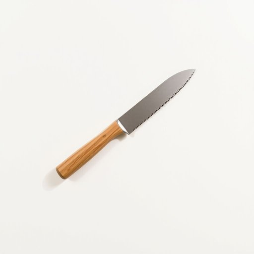

# bread-knife

<h1 style="font-size: 2.5em; font-weight: 300; letter-spacing: 2px; margin: 0; color: #2c3e50;">
/bread-knife*/
</h1>

---

---

## 例句

I couldn’t believe it when the technician told me that the scanner, which I bought last month to improve my home office setup, was malfunctioning because of a software update that conflicted with the new driver installed automatically overnight.

*I(/aɪ/) couldn’t(/couldn’t*/) believe(/bɪˈliv/) it(/ɪt/) when(/wɪn/) the(/ðə/) technician(/tɛkˈnɪʃən/) told(/toʊld/) me(/mi/) that(/ðət/) the(/ðə/) scanner,(/ˈskænər,/) which(/wɪʧ/) I(/aɪ/) bought(/bɔt/) last(/læst/) month(/mənθ/) to(/tɪ/) improve(/ˌɪmˈpruv/) my(/maɪ/) home(/hoʊm/) office(/ˈɔfəs/) setup,(/ˈsɛˌtəp,/) was(/wɑz/) malfunctioning(/mælˈfəŋkʃənɪŋ/) because(/bɪˈkəz/) of(/əv/) a(/ə/) software(/ˈsɔfˌwɛr/) update(/ˈəpˌdeɪt/) that(/ðət/) conflicted(/kənˈflɪktɪd/) with(/wɪθ/) the(/ðə/) new(/nu/) driver(/ˈdraɪvər/) installed(/ˌɪnˈstɔld/) automatically(/ˌɔtəˈmætɪkli/) overnight.(/ˈoʊvərˈnaɪt./)*

**翻译：** 当技术人员告诉我，上个月为改善家庭办公环境而购买的扫描仪因一场与昨夜自动安装的新驱动程序冲突的软件更新而出现故障时，我简直不敢相信。

---

## 解释

英语单词“bread-knife”作为名词，指的是一种专门用于切面包的刀具，通常具有锯齿状的刀刃，便于切割硬脆的面包外壳而不压碎内部松软的面包组织。其具体使用场合多见于家庭厨房或餐厅中，常用于早餐或餐后切割面包、法棍等食物。英语学习者在使用“bread-knife”时应注意，作为复合名词，通常整体作为单数使用，但也可以加复数形式“bread-knives”，且在表达时要连写或用连字符连接，以保持词义明确。同时，“bread-knife”在语法上多用作可数名词，可和冠词、数词连用，如“a bread-knife”或“two bread-knives”。常见搭配包括“use a bread-knife”（使用面包刀）、“sharpen the bread-knife”（磨刀）等。词源方面，“bread-knife”由“bread”（面包）和“knife”（刀）直接复合而成，体现了其专用性，这种命名方式在英语复合词中十分常见，表达了该刀具专为面包而设计的特点。在中文语境中，“bread-knife”准确翻译为“面包刀”，强调工具用途，且不同于普通厨刀，其锯齿形刀刃是面包刀的关键特征，便于区分。该词语无特殊褒贬含义或文化色彩，属于日常家居生活用品范畴，使用时务必注意区分用于切割面包的专用刀具和其他多用途厨刀。

---

<small style="color: #999; font-size: 0.9em;">2025-07-17 06:22:39</small>

