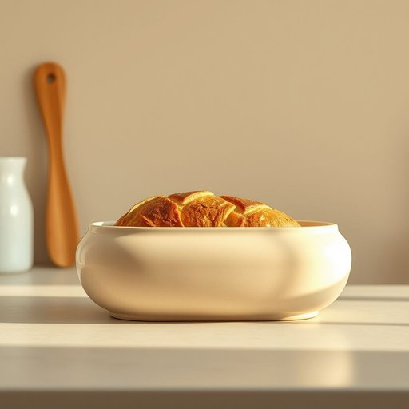

# breadbin

<h1 style="font-size: 2.5em; font-weight: 300; letter-spacing: 2px; margin: 0; color: #2c3e50;">
/breadbin*/
</h1>

---

---

## 例句

After noticing that the freshly baked loaves were cooling on the kitchen counter, she carefully transferred them into the antique ceramic breadbin, which not only preserved their crusty texture better than a plastic bag but also added a rustic charm to the otherwise modern interior.

*After(/ˈæftər/) noticing(/ˈnoʊtɪsɪŋ/) that(/ðət/) the(/ðə/) freshly(/ˈfrɛʃli/) baked(/beɪkt/) loaves(/loʊvz/) were(/wər/) cooling(/ˈkulɪŋ/) on(/ɔn/) the(/ðə/) kitchen(/ˈkɪʧən/) counter,(/ˈkaʊntər,/) she(/ʃi/) carefully(/ˈkɛrfəli/) transferred(/ˈtrænsfərd/) them(/ðɛm/) into(/ˈɪntu/) the(/ðə/) antique(/ænˈtik/) ceramic(/sərˈæmɪk/) breadbin,(/breadbin*,/) which(/wɪʧ/) not(/nɑt/) only(/ˈoʊnli/) preserved(/prɪˈzərvd/) their(/ðɛr/) crusty(/ˈkrəsti/) texture(/ˈtɛksʧər/) better(/ˈbɛtər/) than(/ðən/) a(/ə/) plastic(/ˈplæstɪk/) bag(/bæg/) but(/bət/) also(/ˈɔlsoʊ/) added(/ˈædɪd/) a(/ə/) rustic(/ˈrəstɪk/) charm(/ʧɑrm/) to(/tɪ/) the(/ðə/) otherwise(/ˈəðərˌwaɪz/) modern(/ˈmɑdərn/) interior.(/ˌɪnˈtɪriər./)*

**翻译：** 注意到刚出炉的面包正放在厨房台面上晾凉，她小心翼翼地将它们转移进那只古董陶瓷面包盒，这不仅比塑料袋更好地保持了外壳的酥脆质感，也为现代风格的室内增添了一抹乡村的韵味。

---

## 解释

英语单词“breadbin”作为名词，指的是一种专门用来存放面包的容器或橱柜，常见于厨房的家居生活用品中，能够保持面包的新鲜，防止其过快变干或发霉。具体使用场合通常是在描述厨房收纳或食物储存环境时，如“The bread is kept in the breadbin to stay fresh”（面包放在面包箱里保持新鲜）。学习者使用时需要注意“breadbin”是可数名词，复数形式为“breadbins”，且多数情况下作为单数普通名词使用，可直接作为句子的主语或宾语。常见搭配有“open the breadbin”（打开面包箱）、“put bread into the breadbin”（把面包放进面包箱）等，且一般不与冠词省略，通常使用定冠词“the”或不定冠词“a/an”修饰。此外，“breadbin”作为名词没有动词形式，也不常见相关的派生词；在语法结构中，它作名词使用，通常与动词或介词短语搭配。词源上，“breadbin”由“bread”（面包）与“bin”（箱子，储藏容器）复合而成，bin一词源自古英语“binn”，意指容器或箱子，反映其功能性和储藏用途。该词在英语中多用于英式英语环境，美式英语中较少使用，可能用“bread box”更常见。中文语境中，“breadbin”准确翻译为“面包箱”或“面包盒”，强调其专门的存放功能，有助于理解其作为厨房用具的专属性和实用性。该词无褒贬义，属于中性词汇，主要体现日常生活中的整理与储存习惯，无特殊文化色彩，但在英国家庭厨房中较为常见，反映一定的生活习惯和家庭环境管理方式。

---

<small style="color: #999; font-size: 0.9em;">2025-07-17 06:22:39</small>

