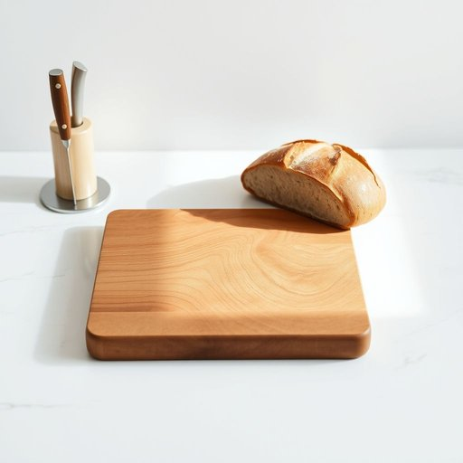

# breadboard

<h1 style="font-size: 2.5em; font-weight: 300; letter-spacing: 2px; margin: 0; color: #2c3e50;">
/breadboard*/
</h1>

---

---

## 例句

Could you please pass me the breadboard that's usually kept next to the knife block, as I need to slice the fresh sourdough carefully without squashing it before we prepare the sandwiches for the picnic?

*Could(/kʊd/) you(/ju/) please(/pliz/) pass(/pæs/) me(/mi/) the(/ðə/) breadboard(/breadboard*/) that's(/ðæts/) usually(/ˈjuʒəwəli/) kept(/kɛpt/) next(/nɛkst/) to(/tɪ/) the(/ðə/) knife(/naɪf/) block,(/blɑk,/) as(/ɛz/) I(/aɪ/) need(/nid/) to(/tɪ/) slice(/slaɪs/) the(/ðə/) fresh(/frɛʃ/) sourdough(/sourdough*/) carefully(/ˈkɛrfəli/) without(/wɪˈθaʊt/) squashing(/skˈwɑʃɪŋ/) it(/ɪt/) before(/ˌbiˈfɔr/) we(/wi/) prepare(/priˈpɛr/) the(/ðə/) sandwiches(/ˈsænwɪʧɪz/) for(/fər/) the(/ðə/) picnic?(/ˈpɪkˌnɪk?/)*

**翻译：** 请把那块通常放在刀架旁边的切菜板递给我，好让我在准备野餐三明治之前，仔细地将新鲜的酸面包片切好，避免压扁。

---

## 解释

breadboard作为名词在家居生活用品的语境中，主要指的是厨房中用来切面包或其他食材的砧板，通常是扁平且坚固的木质或塑料板，方便切削和食品准备。使用场合一般是家庭厨房或食品加工区，常见搭配有wooden breadboard（木质砧板）、use a breadboard to slice bread（用砧板切面包）等，英语学习者需注意其作为具体可数名词的用法，复数形式为breadboards，不可用作抽象概念且通常不表示其他含义。该词源于19世纪，最初指简单木板用以切割面包，bread指面包，board指板子，合成词表达其功能属性，后来逐渐固定为厨房用具名称，此外breadboard在电子学领域还有面包板之意，但在家居生活用品场景中不涵盖该技术含义。在中文语境中，准确翻译为砧板或切面包板，理解时应区分其特定用途，即专指厨房中切割面包等食材的板子，不应混淆为电子面包板或其他用途。该词无特殊褒贬色彩，属中性词汇，体现了厨房日常生活中常见工具的命名方式，反映了语言通过形象实物组合产生的词汇形成规律。

---

<small style="color: #999; font-size: 0.9em;">2025-07-17 06:22:39</small>

