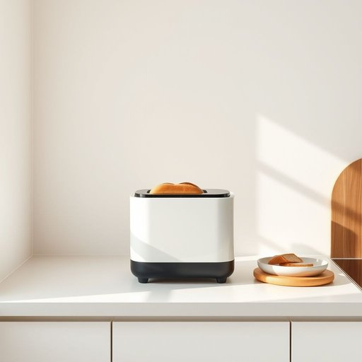

# breadmaker

<h1 style="font-size: 2.5em; font-weight: 300; letter-spacing: 2px; margin: 0; color: #2c3e50;">
/breadmaker*/
</h1>

---

---

## 例句

Since she had recently moved into a new flat with a compact kitchen, my sister, who loves baking but often found it time-consuming, decided to invest in a breadmaker, which not only allowed her to prepare fresh, homemade loaves conveniently but also offered various settings for different types of bread, proving to be an indispensable appliance in her daily routine.

*Since(/sɪns/) she(/ʃi/) had(/hæd/) recently(/ˈrisəntli/) moved(/muvd/) into(/ˈɪntu/) a(/ə/) new(/nu/) flat(/flæt/) with(/wɪθ/) a(/ə/) compact(/ˈkɑmpækt/) kitchen,(/ˈkɪʧən,/) my(/maɪ/) sister,(/ˈsɪstər,/) who(/hu/) loves(/ləvz/) baking(/ˈbeɪkɪŋ/) but(/bət/) often(/ˈɔfən/) found(/faʊnd/) it(/ɪt/) time-consuming,(/time-consuming*,/) decided(/ˌdɪˈsaɪdɪd/) to(/tɪ/) invest(/ˌɪnˈvɛst/) in(/ɪn/) a(/ə/) breadmaker,(/breadmaker*,/) which(/wɪʧ/) not(/nɑt/) only(/ˈoʊnli/) allowed(/əˈlaʊd/) her(/hər/) to(/tɪ/) prepare(/priˈpɛr/) fresh,(/frɛʃ,/) homemade(/ˈhoʊˈmeɪd/) loaves(/loʊvz/) conveniently(/kənˈvinjəntli/) but(/bət/) also(/ˈɔlsoʊ/) offered(/ˈɔfərd/) various(/ˈvɛriəs/) settings(/ˈsɛtɪŋz/) for(/fər/) different(/ˈdɪfərənt/) types(/taɪps/) of(/əv/) bread,(/brɛd,/) proving(/ˈpruvɪŋ/) to(/tɪ/) be(/bi/) an(/ən/) indispensable(/ˌɪndɪˈspɛnsəbəl/) appliance(/əˈplaɪəns/) in(/ɪn/) her(/hər/) daily(/ˈdeɪli/) routine.(/ruˈtin./)*

**翻译：** 由于她最近搬进了一间带有紧凑厨房的新公寓，我的姐姐一位热爱烘焙但常觉得耗时的朋友决定购买一台面包机。这台面包机不仅让她能够方便地制作新鲜的自制面包，还提供多种不同面包类型的设置，成为她日常生活中不可或缺的家电。

---

## 解释

单词“breadmaker”在家居生活用品场景中作为名词，指的是一种用于制作面包的厨房电器，即“面包机”。具体使用场合通常是在描述厨房用具或食物制作时，例如谈论早餐准备、烘焙习惯或者厨房设备的选择时会用到。英语学习者使用该词时应注意它是可数名词，常见搭配包括“buy a breadmaker”（买一台面包机）、“use a breadmaker to bake bread”（用面包机烤面包）等，且该词没有复数特殊形式，复数规则同一般可数名词，即“breadmakers”。表达时可结合具体动作如“set the breadmaker to bake”（设置面包机烘烤）来使用，突出口语表达的自然性。词源上，breadmaker由“bread”（面包）和“maker”（制造者）复合而成，maker在这里泛指能够制造或制作某物的工具或机器，反映了该设备的功能属性。在中文语境中，breadmaker准确翻译为“面包机”，强调其作为一种家用电器的身份，区别于传统手工或商用烘焙工具。该词本身没有特殊的语言色彩或褒贬含义，使用时多带有便利和现代生活的正面联想，适合描述现代家庭中方便制作面包的设备。

---

<small style="color: #999; font-size: 0.9em;">2025-07-17 06:22:39</small>

