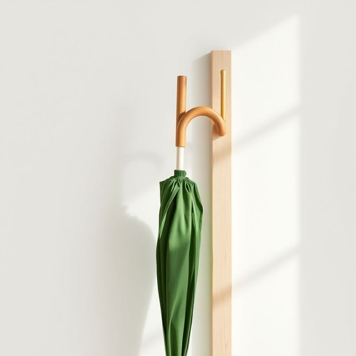

# brolly

<h1 style="font-size: 2.5em; font-weight: 300; letter-spacing: 2px; margin: 0; color: #2c3e50;">
/ˈbrɑli/
</h1>

---

---

## 例句

Could you please grab the green brolly from the hall stand, the one with the wooden handle that Dad bought last autumn, because it looks like it's going to pour any minute and we don't want to get soaked on our way to the shops?

*Could(/kʊd/) you(/ju/) please(/pliz/) grab(/græb/) the(/ðə/) green(/grin/) brolly(/ˈbrɑli/) from(/frəm/) the(/ðə/) hall(/hɔl/) stand,(/stænd,/) the(/ðə/) one(/wən/) with(/wɪθ/) the(/ðə/) wooden(/ˈwʊdən/) handle(/ˈhændəl/) that(/ðət/) Dad(/dæd/) bought(/bɔt/) last(/læst/) autumn,(/ˈɔtəm,/) because(/bɪˈkəz/) it(/ɪt/) looks(/lʊks/) like(/laɪk/) it's(/ɪts/) going(/goʊɪŋ/) to(/tɪ/) pour(/pɔr/) any(/ˈɛni/) minute(/ˈmɪnət/) and(/ənd/) we(/wi/) don't(/doʊnt/) want(/wɔnt/) to(/tɪ/) get(/gɪt/) soaked(/soʊkt/) on(/ɔn/) our(/ɑr/) way(/weɪ/) to(/tɪ/) the(/ðə/) shops?(/ʃɑps?/)*

**翻译：** 你能帮我从门厅的伞架上拿把绿色的伞吗？就是爸爸去年秋天买的那把带木质伞柄的，因为看起来马上就要下大雨了，我们不想在去商店的路上被淋湿。

---

## 解释

英语单词“brolly”作为名词，主要指代雨伞，属于非正式或口语用法，常见于英国英语中，尤其是日常生活场景中，如家居生活用品介绍或谈论天气时使用。使用“brolly”时，英语学习者应注意它是“umbrella”的缩略和俚语形式，语法上与普通名词相同，可作主语、宾语或定语，如“Take your brolly in case it rains.”，但在正式场合应避免使用。此外，“brolly”常与动词“take”、“grab”、“carry”搭配，用于表达携带雨伞的行为，并且其非正式性质意味着在书面或正式写作中建议使用“umbrella”。“brolly”一词起源于19世纪的英国，可能是对“umbrella”音节简化的俏皮表达，带有亲切和生活化色彩，属于英式英语中的俚语词汇。在中文语境中，“brolly”准确翻译为“雨伞”，强调其为日常口语表达，通常没有褒贬含义，但体现出较为轻松或随意的语言风格，使用时应根据语境选择是否采用该词，确保表达的得体与准确。

---

<small style="color: #999; font-size: 0.9em;">2025-07-17 06:22:39</small>

