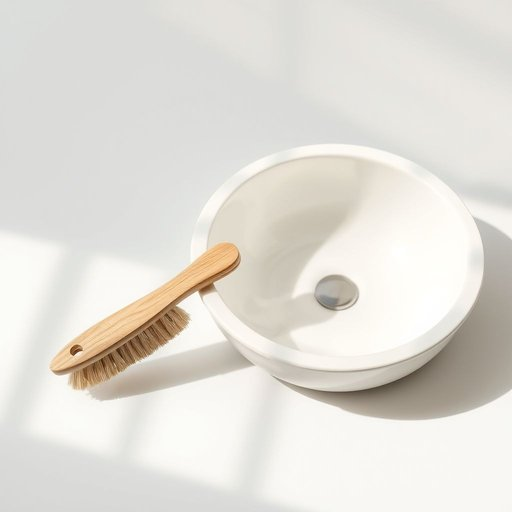

# brush

<h1 style="font-size: 2.5em; font-weight: 300; letter-spacing: 2px; margin: 0; color: #2c3e50;">
/brəʃ/
</h1>

---

---

## 例句

Could you please pass me the brush that’s sitting next to the sink, the one with the wooden handle and stiff bristles, because I need to scrub the stubborn tea stains off the bottom of this mug before washing up.

*Could(/kʊd/) you(/ju/) please(/pliz/) pass(/pæs/) me(/mi/) the(/ðə/) brush(/brəʃ/) that’s(/that’s*/) sitting(/ˈsɪtɪŋ/) next(/nɛkst/) to(/tɪ/) the(/ðə/) sink,(/sɪŋk,/) the(/ðə/) one(/wən/) with(/wɪθ/) the(/ðə/) wooden(/ˈwʊdən/) handle(/ˈhændəl/) and(/ənd/) stiff(/stɪf/) bristles,(/ˈbrɪsəlz,/) because(/bɪˈkəz/) I(/aɪ/) need(/nid/) to(/tɪ/) scrub(/skrəb/) the(/ðə/) stubborn(/ˈstəbərn/) tea(/ti/) stains(/steɪnz/) off(/ɔf/) the(/ðə/) bottom(/ˈbɑtəm/) of(/əv/) this(/ðɪs/) mug(/məg/) before(/ˌbiˈfɔr/) washing(/ˈwɑʃɪŋ/) up.(/əp./)*

**翻译：** 你能把放在水槽旁边的那把刷子递给我吗？就是那把带木质手柄、毛硬的刷子，因为我需要用它把这个杯子底部顽固的茶渍刷掉，才能洗干净。

---

## 解释

英语单词"brush"作为名词在家居生活用品语境中，通常指用来清洁、梳理或涂抹的工具，如牙刷（toothbrush）、毛刷（hairbrush）、扫帚刷（broom brush）等，具体使用场合包括日常个人卫生、整理仪表、清洁房屋或园艺等场景。英语学习者在使用该词时需注意其单数复数形式brush/brushes，且作为可数名词时前面通常可加冠词a/an或数词，同时常见搭配包括"toothbrush"（牙刷）、"paintbrush"（油漆刷）、"hairbrush"（发刷）等，表达时可结合具体用途或材质，如"soft brush"（软毛刷）或"electric toothbrush"（电动牙刷）以增强描述准确性。词源上，"brush"源自中古英语，可能来源于古法语"brosse"，本义为带有硬毛的刷子，与拉丁语和古日耳曼语派生词相关，反映其作为清洁工具的传统功能。中文语境中，"brush"准确翻译为刷子，强调其工具属性，无特殊褒贬含义或文化色彩，但根据具体用途不同，其对应的中文名称会更具象，如牙刷、毛刷、扫刷等，使用时应根据具体上下文选择准确词汇，避免泛泛而谈。总体而言，该词在家居生活用品中为常用名词，表达清洁和整理工具的基本概念，语义明确且应用广泛。

---

<small style="color: #999; font-size: 0.9em;">2025-07-17 06:22:39</small>

