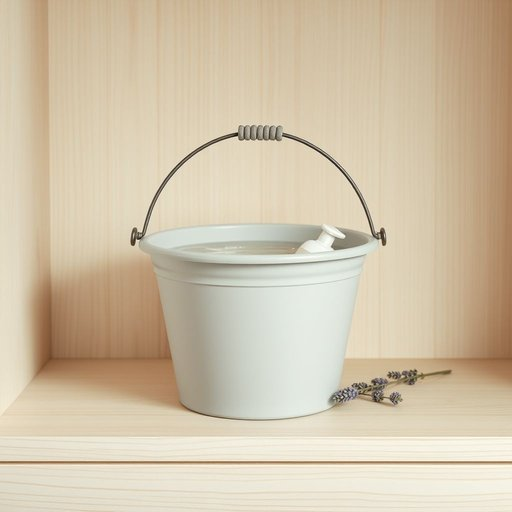

# bucket

<h1 style="font-size: 2.5em; font-weight: 300; letter-spacing: 2px; margin: 0; color: #2c3e50;">
/ˈbəkɪt/
</h1>

---

---

## 例句

Could you please fill the bucket, which contains warm water and the lavender-scented soap on the shelf, so that I can give the kitchen floor a proper scrub before our guests arrive this evening?

*Could(/kʊd/) you(/ju/) please(/pliz/) fill(/fɪl/) the(/ðə/) bucket,(/ˈbəkɪt,/) which(/wɪʧ/) contains(/kənˈteɪnz/) warm(/wɔrm/) water(/ˈwɔtər/) and(/ənd/) the(/ðə/) lavender-scented(/lavender-scented*/) soap(/soʊp/) on(/ɔn/) the(/ðə/) shelf,(/ʃɛlf,/) so(/soʊ/) that(/ðət/) I(/aɪ/) can(/kən/) give(/gɪv/) the(/ðə/) kitchen(/ˈkɪʧən/) floor(/flɔr/) a(/ə/) proper(/ˈprɑpər/) scrub(/skrəb/) before(/ˌbiˈfɔr/) our(/ɑr/) guests(/gɛsts/) arrive(/əraɪv/) this(/ðɪs/) evening?(/ˈivnɪŋ?/)*

**翻译：** 请帮我把桶装满温水，里面放上架子上的薰衣草香皂，这样我就能在今晚客人到来之前，好好地擦洗一下厨房地板。

---

## 解释

英语单词“bucket”作为名词在家居生活用品的语境中，指的是一种有柄的桶状容器，通常用于盛水、清洁或搬运液体及其他物品，常见于家庭打扫、园艺浇水或厨房等场合。英语学习者在使用该词时应注意“bucket”为可数名词，复数形式为“buckets”，且常与介词搭配如“一桶水”（a bucket of water）、“把桶装满”（fill the bucket）等，表达时需注意冠词和数量词的搭配。此外，“bucket”可以用作动词表达倾盆而降的雨（如“it’s bucketing down”），但此用法与家居用品语境不同。该词源自中古英语“boket”，可能起源于古法语“bouquet”或低地德语，最初指一种小桶或提桶。中文语境中，“bucket”准确翻译为“桶”，强调的是其便携性和圆形开口，区别于更大或材质不同的容器如“盆”或“缸”。一般没有褒贬色彩，是中性词，但在非正式口语中有时“bucket list”（遗愿清单）的固定用法与本意无关，使用时需区分语境。整体来说，“bucket”作为家用物品词汇简单实用，语法规则明确，适合表达日常生活中盛水或清洁等动作。

---

<small style="color: #999; font-size: 0.9em;">2025-07-17 06:22:39</small>

