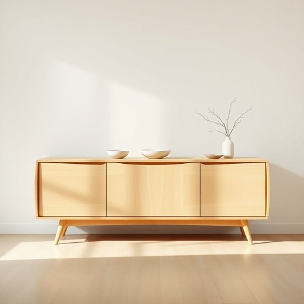

# buffet

<h1 style="font-size: 2.5em; font-weight: 300; letter-spacing: 2px; margin: 0; color: #2c3e50;">
/ˈbəfət/
</h1>

---

---

## 例句

As the storm’s fierce winds began to buffet the coastal cliffs, the hotel’s luxurious buffet on the terrace offered guests a warm refuge where they could savor an exquisite array of gourmet dishes while watching the tempest rage outside.

*As(/ɛz/) the(/ðə/) storm’s(/storm’s*/) fierce(/fɪrs/) winds(/wɪndz/) began(/bɪˈgæn/) to(/tɪ/) buffet(/ˈbəfət/) the(/ðə/) coastal(/ˈkoʊstəl/) cliffs,(/klɪfs,/) the(/ðə/) hotel’s(/hotel’s*/) luxurious(/ləgˈʒəriəs/) buffet(/ˈbəfət/) on(/ɔn/) the(/ðə/) terrace(/ˈtɛrəs/) offered(/ˈɔfərd/) guests(/gɛsts/) a(/ə/) warm(/wɔrm/) refuge(/ˈrɛfjuʤ/) where(/wɛr/) they(/ðeɪ/) could(/kʊd/) savor(/ˈseɪvər/) an(/ən/) exquisite(/ˈɛkskwəzət/) array(/əreɪ/) of(/əv/) gourmet(/ˈgʊrˌmeɪ/) dishes(/ˈdɪʃɪz/) while(/waɪl/) watching(/ˈwɑʧɪŋ/) the(/ðə/) tempest(/ˈtɛmpəst/) rage(/reɪʤ/) outside.(/ˈaʊtˈsaɪd./)*

**翻译：** 当暴风猛烈的狂风开始猛烈袭击海岸悬崖时，酒店露台上的豪华自助餐为宾客提供了一个温暖的避风港，在这里他们可以品味精美的美食佳肴，同时观赏外面风暴的激烈肆虐。

---

## 解释

英语单词“buffet”在家居生活用品场景中作为名词，通常指一种用于存放餐具、餐盘或食物的家具，类似于中式的“餐边柜”或“餐具柜”，一般放置在餐厅或客厅，方便用餐时取用。具体使用场合多见于描述家具布置或家庭餐厅环境，如“The dining room has a beautiful wooden buffet to hold dishes and silverware.”英语学习者在使用“buffet”作为名词时需注意其不可与动词“buffet”（意为“打击”）混淆，且名词时多与定冠词the或形容词连用，常见搭配包括“a buffet table”（自助餐台）、“a sideboard buffet”（餐边柜），表达时可用“place on the buffet”指把东西放在餐边柜上。词源上，“buffet”源自法语，原指“餐具橱柜、柜台”，来自古法语“bufet”，意为小橱柜或矮桌，反映了该词的家具属性。在中文语境中，“buffet”准确对应“餐边柜”“餐具柜”或“餐台”，不能简单译为“自助餐”，后者在中文强调的是一种用餐形式而非家具。此词在家居语境通常为中性词，无褒贬色彩，但在表达上需依据具体场景区分其为家具或餐饮形式，避免歧义。

---

<small style="color: #999; font-size: 0.9em;">2025-07-17 06:22:39</small>

