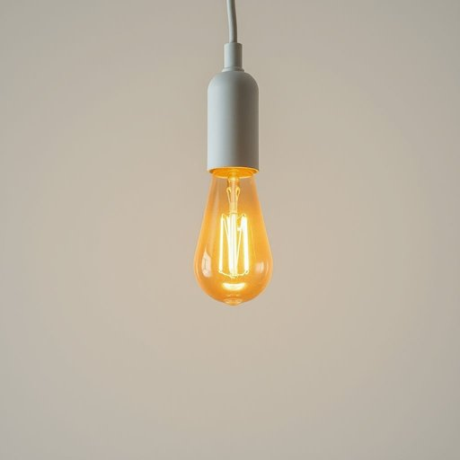

# bulb

<h1 style="font-size: 2.5em; font-weight: 300; letter-spacing: 2px; margin: 0; color: #2c3e50;">
/bəlb/
</h1>

---

---

## 例句

Could you please check the kitchen lamp and see if the bulb, which has been flickering intermittently for the past few days despite being replaced recently, needs swapping again or if there might be an issue with the wiring?

*Could(/kʊd/) you(/ju/) please(/pliz/) check(/ʧɛk/) the(/ðə/) kitchen(/ˈkɪʧən/) lamp(/læmp/) and(/ənd/) see(/si/) if(/ɪf/) the(/ðə/) bulb,(/bəlb,/) which(/wɪʧ/) has(/həz/) been(/bɪn/) flickering(/ˈflɪkərɪŋ/) intermittently(/ˌɪntərˈmɪtəntli/) for(/fər/) the(/ðə/) past(/pæst/) few(/fju/) days(/deɪz/) despite(/dɪˈspaɪt/) being(/biɪŋ/) replaced(/ˌriˈpleɪst/) recently,(/ˈrisəntli,/) needs(/nidz/) swapping(/sˈwɑpɪŋ/) again(/əˈgɛn/) or(/ər/) if(/ɪf/) there(/ðɛr/) might(/maɪt/) be(/bi/) an(/ən/) issue(/ˈɪʃu/) with(/wɪθ/) the(/ðə/) wiring?(/ˈwaɪrɪŋ?/)*

**翻译：** 请您帮忙检查一下厨房的灯具，看看那只最近刚换过但这几天断断续续闪烁的灯泡是否需要再次更换，还是线路可能存在故障？

---

## 解释

英语单词"bulb"作为名词，在家居生活用品的语境中，通常指灯泡，即用于发光的电器元件，广泛应用于室内照明设备，如台灯、吊灯或壁灯等。使用时常见搭配有"light bulb"（灯泡）、"incandescent bulb"（白炽灯泡）、"LED bulb"（LED灯泡）等，学习者应注意"bulb"作可数名词时复数形式是"bulbs"，通常与数量词连用，例如"a bulb"、"two bulbs"。此外，"bulb"还可指种植的球茎植物，虽然在家居用品语境中主要指灯泡，但了解该词双重含义有助于避免歧义。该词源自拉丁语"bulbus"，意为洋葱或球茎，后引申为形状类似球茎的物体，因最初的灯泡造型类似球形球茎而得名。在中文语境中，"bulb"准确译为“灯泡”，表示家庭照明的实物器具，通常无褒贬色彩，属于中性词汇，仅在特定技术或历史讨论中才有特殊含义。总体而言，"bulb"是家庭生活中常见且实用的词汇，掌握其基本用法及搭配，有助于英语学习者准确表达与家庭照明相关的内容。

---

<small style="color: #999; font-size: 0.9em;">2025-07-17 06:22:39</small>

