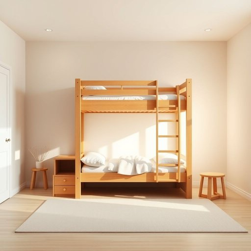

# bunk-bed

<h1 style="font-size: 2.5em; font-weight: 300; letter-spacing: 2px; margin: 0; color: #2c3e50;">
/bunk-bed*/
</h1>

---

---

## 例句

Since space is limited in the children's room, the bunk-bed serves as a practical solution by combining sleeping arrangements with storage functionality, thereby optimizing room usage efficiently.

*Since(/sɪns/) space(/speɪs/) is(/ɪz/) limited(/ˈlɪmɪtɪd/) in(/ɪn/) the(/ðə/) children's(/ˈʧɪldrənz/) room,(/rum,/) the(/ðə/) bunk-bed(/bunk-bed*/) serves(/sərvz/) as(/ɛz/) a(/ə/) practical(/ˈpræktɪkəl/) solution(/səˈluʃən/) by(/baɪ/) combining(/kəmˈbaɪnɪŋ/) sleeping(/sˈlipɪŋ/) arrangements(/ərˈeɪnʤmənts/) with(/wɪθ/) storage(/ˈstɔrɪʤ/) functionality,(/ˌfəŋkʃəˈnælɪti,/) thereby(/ˈðɛrˈbaɪ/) optimizing(/optimizing*/) room(/rum/) usage(/ˈjusɪʤ/) efficiently.(/ɪˈfɪʃəntli./)*

**翻译：** 由于儿童房空间有限，双层床通过将睡眠安排与储物功能相结合，成为一种实用的解决方案，从而有效地优化了房间的使用。

---

## 解释

“bunk-bed”作为名词，在家居生活用品语境中指的是上下铺床，即一张床架上叠放两张床铺，通常用于节省空间，广泛应用于儿童房、宿舍、军营或青年旅舍等场合。英语学习者在使用该词时需注意其为可数名词，复数形式为“bunk-beds”，常见搭配有“一套上下铺床”（a set of bunk-beds）、“金属/木质上下铺床”（metal/wooden bunk-beds）等，表达时常与“sleep”、“room”或“children”等词连用，如“children’s room with bunk-beds”。词源方面，“bunk”最初指狭小简单的床铺或卧铺，起源于18世纪英语，意指狭窄的睡觉空间，“bed”则是床的通称，两者结合形成“bunk-bed”特指叠放式床铺。中文语境中，“bunk-bed”通常译作“上下铺床”或“上下床”，强调空间节约与多重睡眠功能，符合实用家居用语习惯，无褒贬色彩，但因结构简单便捷，常与儿童或集体宿舍相关联，带有一定的生活实用和功能性文化内涵。

---

<small style="color: #999; font-size: 0.9em;">2025-07-17 06:22:39</small>

