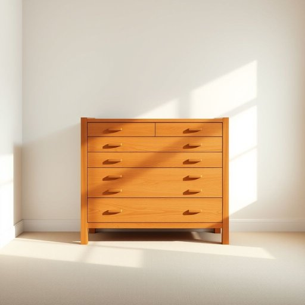

# bureau

<h1 style="font-size: 2.5em; font-weight: 300; letter-spacing: 2px; margin: 0; color: #2c3e50;">
/ˈbjʊroʊ/
</h1>

---

---

## 例句

After the meeting, the concept of innovation as a driving force in technology was thoroughly discussed, emphasizing its crucial role in shaping the future of industries worldwide.

*After(/ˈæftər/) the(/ðə/) meeting,(/ˈmitɪŋ,/) the(/ðə/) concept(/ˈkɑnsɛpt/) of(/əv/) innovation(/ˌɪnəˈveɪʃən/) as(/ɛz/) a(/ə/) driving(/ˈdraɪvɪŋ/) force(/fɔrs/) in(/ɪn/) technology(/tɛkˈnɑləʤi/) was(/wɑz/) thoroughly(/ˈθəroʊli/) discussed,(/dɪˈskəst,/) emphasizing(/ˈɛmfəˌsaɪzɪŋ/) its(/ɪts/) crucial(/ˈkruʃəl/) role(/roʊl/) in(/ɪn/) shaping(/ˈʃeɪpɪŋ/) the(/ðə/) future(/fˈjuʧər/) of(/əv/) industries(/ˈɪndəstriz/) worldwide.(/ˈwərldˈwaɪd./)*

**翻译：** 会议结束后，深入探讨了创新作为推动技术发展的动力的理念，强调了其在塑造全球各行业未来中的关键作用。

---

## 解释

英语单词bureau在家居生活用品的语境中作为名词，通常指一种带有抽屉的书桌或梳妆台，尤其是带有储物功能的小型桌子，常用于放置书写用品或个人物品，其具体使用场合多为卧室、书房或办公空间，强调其兼具实用与装饰的功能。学习者在使用bureau时需要注意，该词为可数名词，复数形式为bureaus或bureau，其中bureau也有其他含义，如局、办事处等，需根据语境区分；描述家具时常与形容词连用，如wooden bureau（木制书桌）、antique bureau（古董书桌），也可搭配动词drawers（抽屉）来突出其结构特点。词源方面，bureau源自法语，原意为书写用的粗糙亚麻布，后引申为覆盖桌面的布，进而指代桌子，再扩展到办公机构的意义，体现了从物品到机构的语义演变。在中文语境中，bureau对应的准确翻译多为书桌、带抽屉的梳妆台或办公桌，区别于其行政机构含义，尤其在家居用品领域应避免与局混淆。此词本身无褒贬色彩，但在具体语境中会因搭配和使用场合而呈现正式或生活化的风格，英语学习者应结合上下文正确理解和运用。

---

<small style="color: #999; font-size: 0.9em;">2025-07-17 06:22:39</small>

