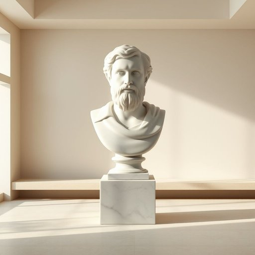

# bust

<h1 style="font-size: 2.5em; font-weight: 300; letter-spacing: 2px; margin: 0; color: #2c3e50;">
/bəst/
</h1>

---

---

## 例句

The extraordinary display of rare manuscripts in the museum captivated scholars and art enthusiasts alike, highlighting the invaluable role of preservation in cultural heritage.

*The(/ðə/) extraordinary(/ˌɛkstrəˈɔrdəˌnɛri/) display(/dɪˈspleɪ/) of(/əv/) rare(/rɛr/) manuscripts(/ˈmænjəˌskrɪpts/) in(/ɪn/) the(/ðə/) museum(/mˈjuziəm/) captivated(/ˈkæptɪˌveɪtɪd/) scholars(/ˈskɑlərz/) and(/ənd/) art(/ɑrt/) enthusiasts(/ɛnˈθuziˌæsts/) alike,(/əˈlaɪk,/) highlighting(/ˈhaɪˌlaɪtɪŋ/) the(/ðə/) invaluable(/ˌɪnˈvæljəbəl/) role(/roʊl/) of(/əv/) preservation(/ˌprɛzərˈveɪʃən/) in(/ɪn/) cultural(/ˈkəlʧərəl/) heritage.(/ˈhɛrɪtɪʤ./)*

**翻译：** 博物馆中珍稀手稿的精彩展出吸引了学者和艺术爱好者的共同关注，彰显了保护文化遗产的无价价值。

---

## 解释

在家居生活用品的语境中，英语单词“bust”作为名词通常指雕塑中的半身像，多为展示人物头部、肩膀及上胸部的塑像，常用作装饰品，摆放于书架、壁炉架或桌面以增添艺术氛围。这一用法多见于描述室内摆设、艺术收藏或陈设品的场合，例如“The living room features a marble bust of a famous philosopher”（客厅摆放着一尊著名哲学家的大理石半身像）。英语学习者在使用“bust”作为名词时应注意，它与动词形式含义截然不同，避免混淆；名词“bust”多与“sculpture”，“statue”，“decoration”，“display”等词搭配，且常以定冠词或指示代词修饰，如“a bust of Beethoven”。其词源来自法语“buste”，再源于意大利语“busto”，最终追溯到拉丁语“bustum”（坟墓），最初指雕刻在墓上的头部像，体现对逝者的纪念。中文中，“bust”准确翻译为“半身像”或“胸像”，强调人体上半部分的艺术雕塑，区别于全身雕像。此词中性、正式，无明显褒贬色彩，纯粹在艺术和装饰语境中使用，但需注意避免将其误用为其他含义，如“破产”或“突袭”，这些含义为动词或其他语境下的用法，避免语义混淆。

---

<small style="color: #999; font-size: 0.9em;">2025-07-17 06:22:39</small>

