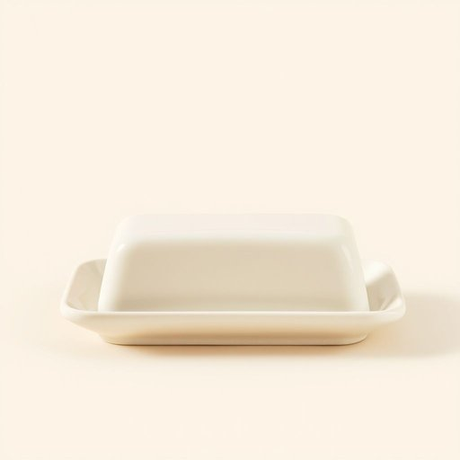

# butter-dish

<h1 style="font-size: 2.5em; font-weight: 300; letter-spacing: 2px; margin: 0; color: #2c3e50;">
/butter-dish*/
</h1>

---

---

## 例句

The intricate machinery of the clockshop fascinated every visitor, as the blend of ancient gears and modern technology created a mesmerizing spectacle that narrated the passage of time with unparalleled precision.

*The(/ðə/) intricate(/ˈɪntrəkət/) machinery(/məˈʃinəri/) of(/əv/) the(/ðə/) clockshop(/clockshop*/) fascinated(/ˈfæsəˌneɪtɪd/) every(/ˈɛvəri/) visitor,(/ˈvɪzɪtər,/) as(/ɛz/) the(/ðə/) blend(/blɛnd/) of(/əv/) ancient(/ˈeɪnʧənt/) gears(/gɪrz/) and(/ənd/) modern(/ˈmɑdərn/) technology(/tɛkˈnɑləʤi/) created(/kriˈeɪtɪd/) a(/ə/) mesmerizing(/ˈmɛzmərˌaɪzɪŋ/) spectacle(/ˈspɛktəkəl/) that(/ðət/) narrated(/ˈnɛˌreɪtɪd/) the(/ðə/) passage(/ˈpæsɪʤ/) of(/əv/) time(/taɪm/) with(/wɪθ/) unparalleled(/ənˈpɛrəˌlɛld/) precision.(/priˈsɪʒən./)*

**翻译：** 钟表店那复杂精巧的机械装置吸引着每一位来访者，古老的齿轮与现代科技的融合，营造出一幕令人着迷的景象，以无与伦比的精准讲述着时间的流逝。

---

## 解释

"butter-dish"作为名词，指的是放置黄油的容器，通常在餐桌或厨房中使用，方便储存和取用黄油，常见于家庭用餐场合或餐厅服务环境中。英语学习者使用该词时需注意，它是一个复合名词，由"butter"（黄油）和"dish"（盘子、容器）组成，整体作名词使用，通常用单数形式butter-dish，复数形式为butter-dishes，前无冠词时可直接表示一类物品，也可加冠词the或a，根据具体语境而定；此外，butter-dish一般作为可数名词出现，偶尔也用复合词butter dish，不带连字符，二者皆可接受，使用时保持一致即可。常见搭配有"glass butter-dish"（玻璃黄油碟）、"ceramic butter-dish"（陶瓷黄油碟）、"covered butter-dish"（带盖的黄油碟）等，表达时多用于描述其材质、形状或功能。该词起源于19世纪，随着黄油作为常见食品需求的增加，专门存放黄油而设计的小盘子逐渐普及，因而产生了butter-dish这一词汇。中文中准确翻译为“黄油碟”或“黄油盒”，强调其专门存放黄油的用途，不应笼统译为“盘子”或“容器”以免引起误解。该词无特殊语义色彩或褒贬含义，纯粹为日常生活用品名称，反映了英美餐饮文化中细致区分食物及其储存用具的习惯。在学习和使用过程中，理解其用途和常见搭配，有助于更准确地表达餐桌礼仪或厨房用具相关内容。

---

<small style="color: #999; font-size: 0.9em;">2025-07-17 06:22:39</small>

