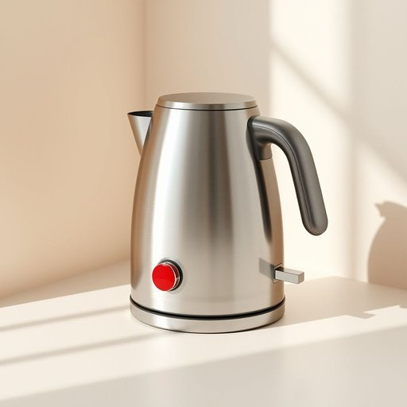

# button

<h1 style="font-size: 2.5em; font-weight: 300; letter-spacing: 2px; margin: 0; color: #2c3e50;">
/ˈbətən/
</h1>

---

---

## 例句

Could you please press the red button on the kettle, which is usually located just below the lid, so that it starts boiling the water before we prepare the tea?

*Could(/kʊd/) you(/ju/) please(/pliz/) press(/prɛs/) the(/ðə/) red(/rɛd/) button(/ˈbətən/) on(/ɔn/) the(/ðə/) kettle,(/ˈkɛtəl,/) which(/wɪʧ/) is(/ɪz/) usually(/ˈjuʒəwəli/) located(/ˈloʊˌkeɪtəd/) just(/ʤɪst/) below(/bɪˈloʊ/) the(/ðə/) lid,(/lɪd,/) so(/soʊ/) that(/ðət/) it(/ɪt/) starts(/stɑrts/) boiling(/ˈbɔɪlɪŋ/) the(/ðə/) water(/ˈwɔtər/) before(/ˌbiˈfɔr/) we(/wi/) prepare(/priˈpɛr/) the(/ðə/) tea?(/ti?/)*

**翻译：** 您能否按一下水壶上通常位于壶盖下方的红色按钮，让水壶开始烧水，以便我们准备泡茶？

---

## 解释

英语单词“button”作为家居生活用品领域的名词，主要指缝制在衣物上用于扣合的纽扣，也可指家具、家电或电子设备上的按键。具体使用场合包括服装的扣合部件，如衬衫、裤子等，也用于家中电器的操作按钮，如电视机上的开关按钮。英语学习者需要注意，“button”作为可数名词，复数形式为“buttons”，且常见搭配有“sew on a button”（缝纽扣）、“push a button”（按按钮）、“button up a coat”（扣上外套），此外，“button”用作动词时表示“扣纽扣”。词源上，“button”来自古法语“bouton”，意为“芽、按钮”，进一步来源于拉丁语“būtō”，指“芽或突起物”，反映其小而圆形的形态特征。在中文语境中，“button”通常准确翻译为“纽扣”或“按钮”，前者强调衣物上的扣合物，后者多指电子设备上的操作键，理解时应结合具体语境区别对待。该词在家居语境中无特殊褒贬色彩或文化内涵，属于中性词汇，直观描述实物功能。

---

<small style="color: #999; font-size: 0.9em;">2025-07-17 06:22:39</small>

