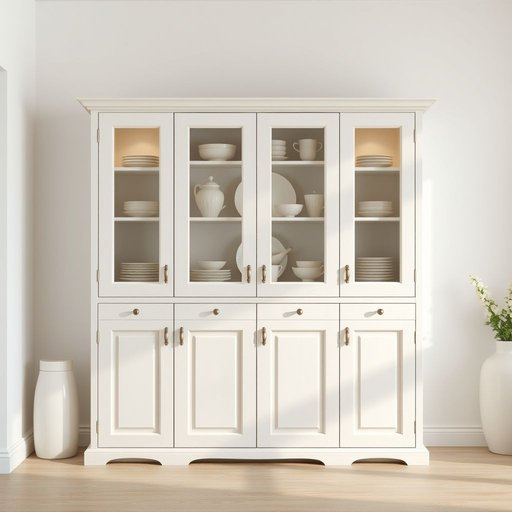

# cabinet

<h1 style="font-size: 2.5em; font-weight: 300; letter-spacing: 2px; margin: 0; color: #2c3e50;">
/ˈkæbənət/
</h1>

---

---

## 例句

Could you please check if the cabinet in the kitchen, which has those glass doors and the intricately carved handles, is sturdy enough to hold the new set of fine china we inherited from Grandma, or should we consider replacing it with something more modern to better match the rest of the decor?

*Could(/kʊd/) you(/ju/) please(/pliz/) check(/ʧɛk/) if(/ɪf/) the(/ðə/) cabinet(/ˈkæbənət/) in(/ɪn/) the(/ðə/) kitchen,(/ˈkɪʧən,/) which(/wɪʧ/) has(/həz/) those(/ðoʊz/) glass(/glæs/) doors(/dɔrz/) and(/ənd/) the(/ðə/) intricately(/ˈɪntrəkətli/) carved(/kɑrvd/) handles,(/ˈhændəlz,/) is(/ɪz/) sturdy(/ˈstərdi/) enough(/ɪˈnəf/) to(/tɪ/) hold(/hoʊld/) the(/ðə/) new(/nu/) set(/sɛt/) of(/əv/) fine(/faɪn/) china(/ˈʧaɪnə/) we(/wi/) inherited(/ˌɪnˈhɛrətɪd/) from(/frəm/) Grandma,(/ˈgrændmɑ,/) or(/ər/) should(/ʃʊd/) we(/wi/) consider(/kənˈsɪdər/) replacing(/rɪˈpleɪsɪŋ/) it(/ɪt/) with(/wɪθ/) something(/ˈsəmθɪŋ/) more(/mɔr/) modern(/ˈmɑdərn/) to(/tɪ/) better(/ˈbɛtər/) match(/mæʧ/) the(/ðə/) rest(/rɛst/) of(/əv/) the(/ðə/) decor?(/ˈdeɪkɔr?/)*

**翻译：** 请您帮忙查看一下厨房里那个带有玻璃门和精美雕刻把手的橱柜是否足够坚固，可以放置我们从奶奶那继承的新一套精致瓷器，或者我们是否应该考虑换一个更现代的橱柜，以更好地与整体装修风格相协调？

---

## 解释

英语单词"cabinet"在家居生活用品语境中作为名词，通常指带门或抽屉的储物柜，用于存放餐具、书籍、衣物或其他家用物品，常见于厨房、客厅或书房等场合。学习者需要注意，"cabinet"作为可数名词，通常与定冠词the或不定冠词a/an搭配使用，比如"a kitchen cabinet"（一个厨房橱柜），且复数形式为"cabinets"。常见搭配有"wall cabinet"（壁柜）、"display cabinet"（陈列柜）和"medicine cabinet"（药品柜），这些词组帮助明确具体柜子的功能或位置。词源方面，"cabinet"源自拉丁语"cabinetum"，意指“小房间”或“私室”，后来演化为指小型储藏家具。中文翻译上，"cabinet"在家居语境中通常译为“橱柜”或“储藏柜”，强调其储物功能，避免与政治意义上的“内阁”混淆。该词在生活用语中较为中性，无褒贬色彩，适合用来描述家具，不具有明显的文化内涵或情感色彩。

---

<small style="color: #999; font-size: 0.9em;">2025-07-17 06:22:39</small>

