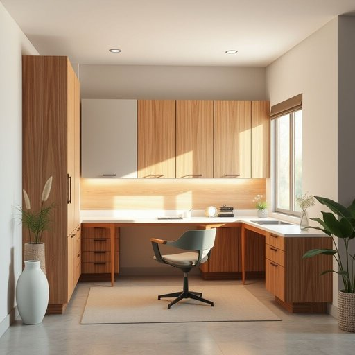

# cabinetry

<h1 style="font-size: 2.5em; font-weight: 300; letter-spacing: 2px; margin: 0; color: #2c3e50;">
/ˈkæbnətri/
</h1>

---

---

## 例句

When the conversation shifted to innovation, she emphasized that the concept, far beyond a mere buzzword, embodied the foundation of their company's growth strategy, blending technology, creativity, and market insight to solve real-world problems effectively.

*When(/wɪn/) the(/ðə/) conversation(/ˌkɑnvərˈseɪʃən/) shifted(/ˈʃɪftɪd/) to(/tɪ/) innovation,(/ˌɪnəˈveɪʃən,/) she(/ʃi/) emphasized(/ˈɛmfəˌsaɪzd/) that(/ðət/) the(/ðə/) concept,(/ˈkɑnsɛpt,/) far(/fɑr/) beyond(/bɪɔnd/) a(/ə/) mere(/mɪr/) buzzword,(/ˈbəzwərd,/) embodied(/ɪmˈbɑdid/) the(/ðə/) foundation(/faʊnˈdeɪʃən/) of(/əv/) their(/ðɛr/) company's(/ˈkəmpəniz/) growth(/groʊθ/) strategy,(/ˈstrætəʤi,/) blending(/ˈblɛndɪŋ/) technology,(/tɛkˈnɑləʤi,/) creativity,(/ˌkrieɪˈtɪvəti,/) and(/ənd/) market(/ˈmɑrkɪt/) insight(/ˈɪnˌsaɪt/) to(/tɪ/) solve(/sɑlv/) real-world(/ˈrilˌwərld/) problems(/ˈprɑbləmz/) effectively.(/ˈifɛktɪvli./)*

**翻译：** 当谈话转向创新时，她强调这一概念远非简单的流行词汇，而是他们公司增长战略的基石，将技术、创造力与市场洞察融合，以有效解决现实世界中的问题。

---

## 解释

单词“cabinetry”作为名词，主要指制作或安装橱柜这一工艺及成品，常用于描述厨房、浴室或其他家居空间中固定的储物柜体结构和相关工艺。具体使用场合多见于装修设计、家具制造、家居装饰等领域，当人们谈论橱柜的设计、工艺水平或整体成套家具时会用到这个词。英语学习者在使用“cabinetry”时需注意，它是不可数名词，通常不用于复数形式，搭配时常用形容词如“custom cabinetry”（定制橱柜）、“modern cabinetry”（现代橱柜），以及介词短语如“in cabinetry”（在橱柜制作领域）。此外，表达技巧上，可将其与动词“install”（安装）、“design”（设计）等连用，搭配表达更自然。该词源自“cabinet”（柜子）一词，加上后缀“-ry”构成抽象名词，表示与柜子相关的工艺或行业。中文语境中，“cabinetry”准确翻译为“橱柜制作工艺”或“橱柜系统”，侧重整体家具结构与制作工艺的概念，而非单个橱柜。该词本身无褒贬色彩，属于中性专业术语，但在家装文化中常带有品质和风格的暗示，例如“高端cabinetry”意指高质量的橱柜制作工艺。理解时应结合具体情境，避免简单直译为“橱柜”，以免丧失其工艺和整体概念的涵义。

---

<small style="color: #999; font-size: 0.9em;">2025-07-17 06:22:39</small>

