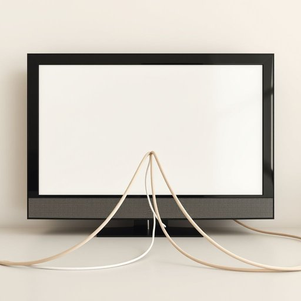

# cable

<h1 style="font-size: 2.5em; font-weight: 300; letter-spacing: 2px; margin: 0; color: #2c3e50;">
/ˈkeɪbəl/
</h1>

---

---

## 例句

Could you please check if the cable behind the television, which connects to both the power socket and the sound system, is securely plugged in before we attempt to fix the flickering screen?

*Could(/kʊd/) you(/ju/) please(/pliz/) check(/ʧɛk/) if(/ɪf/) the(/ðə/) cable(/ˈkeɪbəl/) behind(/bɪˈhaɪnd/) the(/ðə/) television,(/ˈtɛləˌvɪʒən,/) which(/wɪʧ/) connects(/kəˈnɛkts/) to(/tɪ/) both(/boʊθ/) the(/ðə/) power(/paʊər/) socket(/ˈsɑkət/) and(/ənd/) the(/ðə/) sound(/saʊnd/) system,(/ˈsɪstəm,/) is(/ɪz/) securely(/sɪˈkjʊrli/) plugged(/pləgd/) in(/ɪn/) before(/ˌbiˈfɔr/) we(/wi/) attempt(/əˈtɛmpt/) to(/tɪ/) fix(/fɪks/) the(/ðə/) flickering(/ˈflɪkərɪŋ/) screen?(/skrin?/)*

**翻译：** 请您确认电视机背后连接电源插座和音响系统的线缆是否插牢，再进行屏幕闪烁问题的排查。

---

## 解释

单词“cable”作为名词在家居生活用品的语境中，主要指电线、电缆或连接线，常用于连接电子设备如电视、电灯、电脑或充电器等，具体场合包括安装家用电器时、布线家居网络或使用各类电子配件时。英语学习者使用该词时需注意其为可数名词，复数形式为“cables”，且常与动词“run”（铺设）、“connect”（连接）、“plug in”（插入）、“attach”（固定）等搭配出现，表达设备之间的连线或布线操作时用得较多，比如“TV cable”（电视信号线）、“power cable”（电源线）。此外，“cable”还可以用作动词，表示“发电报”，但在家居用品场景中较少涉及。词源上，“cable”源自古法语“cable”及拉丁语“capulum”，意为“绳索”或“钩”，反映出最初指坚固的粗绳，后引申至坚固的电线。中文语境中，“cable”通常准确翻译为“电缆”、“电线”或“连接线”，强调其物理连接和传输能量、信号的功能，属于中性词汇，无特殊褒贬或文化内涵。在日常使用中，理解“cable”应结合具体设备和用途，避免与普通的“wire”（细线）混淆，因为“cable”通常较粗、结实且承载能力更强。

---

<small style="color: #999; font-size: 0.9em;">2025-07-17 06:22:39</small>

