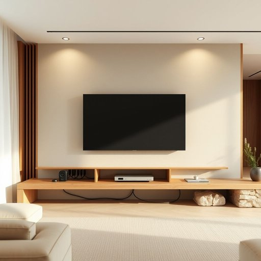

# cabling

<h1 style="font-size: 2.5em; font-weight: 300; letter-spacing: 2px; margin: 0; color: #2c3e50;">
/cabling*/
</h1>

---

---

## 例句

Before the presentation, the complexity of the cabling posed a significant challenge, as the cabling involved multiple layers of outdated power and HDMI wires that required careful assessment to avoid safety hazards.

*Before(/ˌbiˈfɔr/) the(/ðə/) presentation,(/ˌprɛzənˈteɪʃən,/) the(/ðə/) complexity(/kəmˈplɛksɪti/) of(/əv/) the(/ðə/) cabling(/cabling*/) posed(/poʊzd/) a(/ə/) significant(/sɪgˈnɪfɪkənt/) challenge,(/ˈʧælənʤ,/) as(/ɛz/) the(/ðə/) cabling(/cabling*/) involved(/ˌɪnˈvɑlvd/) multiple(/ˈməltəpəl/) layers(/leɪərz/) of(/əv/) outdated(/ˈaʊtˌdeɪtɪd/) power(/paʊər/) and(/ənd/) HDMI(/hdmi*/) wires(/waɪərz/) that(/ðət/) required(/rikˈwaɪərd/) careful(/ˈkɛrfəl/) assessment(/əˈsɛsmənt/) to(/tɪ/) avoid(/əˈvɔɪd/) safety(/ˈseɪfti/) hazards.(/ˈhæzərdz./)*

**翻译：** 在演示之前，布线的复杂性构成了重大的挑战，因为这些布线涉及多层过时的电源线和HDMI线，需谨慎评估以避免安全隐患。

---

## 解释

“cabling”作为名词在家居生活用品的英语语境中，通常指的是布线系统或电缆铺设，具体指为了连接家用电器、网络设备或照明设备而安装的各种电线和电缆。这一词语多用于描述家庭装修、智能家居安装或家庭内部网络布置等场合，强调电缆的布局和连接方式。英语学习者在使用“cabling”时应注意，其作为不可数名词时通常指整体布线系统，不宜随意加复数形式；常见搭配有“cabling system”（布线系统）、“structured cabling”（结构化布线）、“cabling installation”（布线安装）等，表达时可用被动态描述，如“The cabling was professionally installed”（布线由专业人员安装）。此外，cabling源自英文单词“cable”，即“电缆、缆绳”，加上表示动作或过程的-ing后缀，原指敷设电缆的行为，后引申为整体线缆的布设与布置。中文中，“cabling”准确翻译为“布线”或“电缆铺设”，它体现的是一项技术性和工程性的工作，通常不带褒贬含义，仅强调电缆的规划和整齐布置。在家居环境下，良好的“cabling”关系到安全和使用便利性，因此其专业性和规范性是人们关注的重点，文化上也体现出现代家庭对智能化和网络化生活的需求和重视。

---

<small style="color: #999; font-size: 0.9em;">2025-07-17 06:22:39</small>

