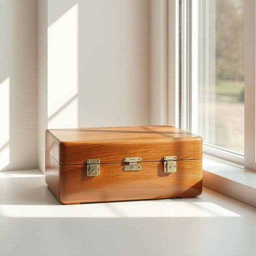

# caddy

<h1 style="font-size: 2.5em; font-weight: 300; letter-spacing: 2px; margin: 0; color: #2c3e50;">
/ˈkædi/
</h1>

---

---

## 例句

Could you please pass me the tea caddy that’s sitting by the window, the one made of polished oak with the intricate brass clasp, since I need to refill the loose leaf tea jars before our guests arrive this afternoon?

*Could(/kʊd/) you(/ju/) please(/pliz/) pass(/pæs/) me(/mi/) the(/ðə/) tea(/ti/) caddy(/ˈkædi/) that’s(/that’s*/) sitting(/ˈsɪtɪŋ/) by(/baɪ/) the(/ðə/) window,(/ˈwɪndoʊ,/) the(/ðə/) one(/wən/) made(/meɪd/) of(/əv/) polished(/ˈpɑlɪʃt/) oak(/oʊk/) with(/wɪθ/) the(/ðə/) intricate(/ˈɪntrəkət/) brass(/bræs/) clasp,(/klæsp,/) since(/sɪns/) I(/aɪ/) need(/nid/) to(/tɪ/) refill(/ˈrifɪl/) the(/ðə/) loose(/lus/) leaf(/lif/) tea(/ti/) jars(/ʤɑrz/) before(/ˌbiˈfɔr/) our(/ɑr/) guests(/gɛsts/) arrive(/əraɪv/) this(/ðɪs/) afternoon?(/ˌæftərˈnun?/)*

**翻译：** 请你把放在窗边的那个茶叶罐递给我，好吗？就是那个用抛光橡木制成、带有精致黄铜扣子的，因为我需要在下午客人来之前给散装茶叶罐补茶。

---

## 解释

英语单词“caddy”在家居生活用品的语境中通常指一种小型容器或收纳盒，专门用于存放和组织茶叶、调味品、文具或其他小物件，常见于厨房或书房场合。使用时，学习者应注意，“caddy”作为名词时是可数名词，常见搭配有“tea caddy”（茶叶罐）、“spice caddy”（调料盒）等，表达时可以用“a caddy for…”来说明用途，例如“a caddy for sugar packets”。语法上，需留意名词单复数形式的变化以及与介词搭配时的习惯用法。词源上，“caddy”起源于18世纪的英国，原指用于携带物品的小盒或容器，源自葡萄牙语“cadie”意为小箱子，逐渐引申为各种收纳用具。中文翻译中，“caddy”多译为“茶叶罐”、“收纳盒”或“储物盒”，强调其功能性收纳容器属性。在中文环境下理解这词时，不带有褒贬色彩，主要体现其实用和整洁的意义，属于中性词汇。总体来说，“caddy”在家居用品语境中是一种方便实用的小型收纳容器，使用时应结合具体物品类别以准确表达。

---

<small style="color: #999; font-size: 0.9em;">2025-07-17 06:22:39</small>

