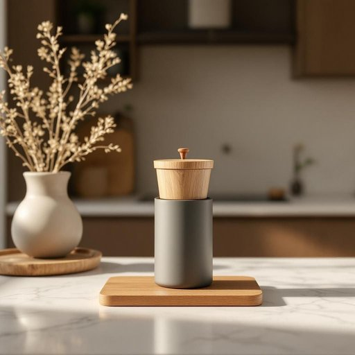

# cafetière

<h1 style="font-size: 2.5em; font-weight: 300; letter-spacing: 2px; margin: 0; color: #2c3e50;">
/cafetière*/
</h1>

---

---

## 例句

After struggling to get the old cafetière to work properly, with its stubborn plunger that seemed stuck and the glass pot that had a tiny crack, she finally decided to replace it with a newer model, hoping that it would not only brew richer coffee but also be easier to clean and handle during her busy mornings.

*After(/ˈæftər/) struggling(/ˈstrəgəlɪŋ/) to(/tɪ/) get(/gɪt/) the(/ðə/) old(/oʊld/) cafetière(/cafetière*/) to(/tɪ/) work(/wərk/) properly,(/ˈprɑpərli,/) with(/wɪθ/) its(/ɪts/) stubborn(/ˈstəbərn/) plunger(/ˈplənʤər/) that(/ðət/) seemed(/simd/) stuck(/stək/) and(/ənd/) the(/ðə/) glass(/glæs/) pot(/pɑt/) that(/ðət/) had(/hæd/) a(/ə/) tiny(/ˈtaɪni/) crack,(/kræk,/) she(/ʃi/) finally(/ˈfaɪnəli/) decided(/ˌdɪˈsaɪdɪd/) to(/tɪ/) replace(/ˌriˈpleɪs/) it(/ɪt/) with(/wɪθ/) a(/ə/) newer(/nuər/) model,(/ˈmɑdəl,/) hoping(/ˈhoʊpɪŋ/) that(/ðət/) it(/ɪt/) would(/wʊd/) not(/nɑt/) only(/ˈoʊnli/) brew(/bru/) richer(/ˈrɪʧər/) coffee(/ˈkɔfi/) but(/bət/) also(/ˈɔlsoʊ/) be(/bi/) easier(/ˈiziər/) to(/tɪ/) clean(/klin/) and(/ənd/) handle(/ˈhændəl/) during(/ˈdʊrɪŋ/) her(/hər/) busy(/ˈbɪzi/) mornings.(/ˈmɔrnɪŋz./)*

**翻译：** 她费了很大力气才让那台老式法式滤压壶正常运作，但活塞依然顽固地卡住了，加之玻璃壶身出现了一道细小的裂痕，最终她决定更换一台更新款，希望不仅能冲泡出更醇厚的咖啡，也能在忙碌的早晨里更加便于清洗和使用。

---

## 解释

英语单词“cafetière”作为名词，主要指一种用来冲煮咖啡的器具，常见于家居生活用品的语境中，特别是在厨房或餐厅场景下使用，典型的形式是法式压滤壶。使用该词时，需要注意它的拼写和发音（英式发音较常见），此外，“cafetière”在英语中较为正式或书面，日常口语中更常用“coffee maker”或“French press”等表达。常见搭配包括“cafetière pot”、“use a cafetière”等，表达时要注意该词为可数名词，复数形式为“cafetieres”。“cafetière”源自法语，原意指咖啡壶，与法语“café”（咖啡）密切相关，体现出该器具源自法国或法语文化背景中普及的咖啡冲泡方式。在中文语境中，准确翻译通常为“法式压滤壶”或“咖啡壶”，理解时应结合具体咖啡制作方式，即利用滤网压制咖啡渣以提取咖啡液，无特殊褒贬含义，但该词具有一定的文化色彩，代表一种较为传统且高品质的手工咖啡制作方式，使用时可体现用户对咖啡品质和生活品味的追求。

---

<small style="color: #999; font-size: 0.9em;">2025-07-17 06:22:39</small>

